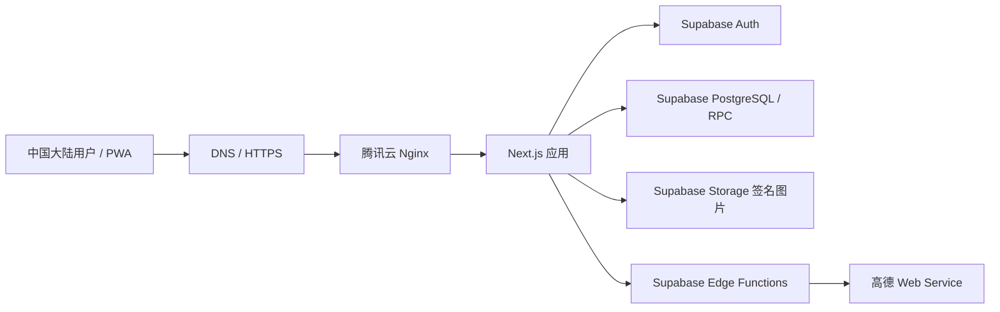
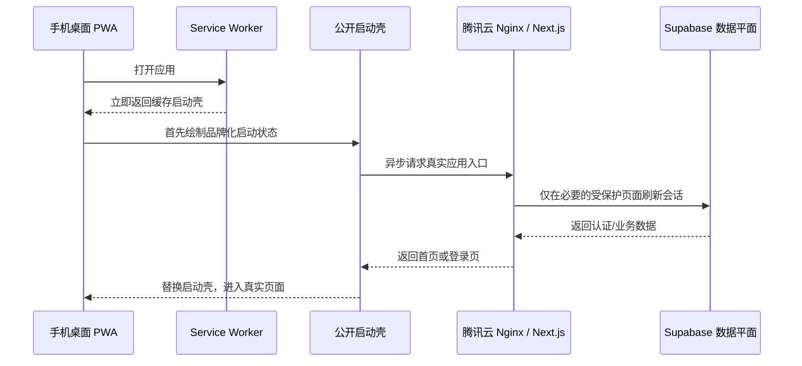
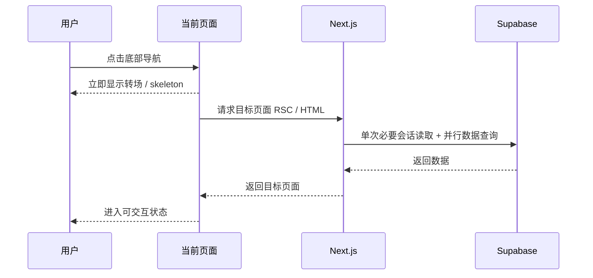

# 食迹 Foodprint｜V2.1 低延迟与用户体验开发交接

> 状态：**草案，待项目负责人批准；本轮只立项和梳理，不进入代码修改**  
> 日期：2026-08-06  
> 建议工作分支：`codex/v2-1-performance-ux`  
> 正式入口：`https://foodprint.com.cn`  
> 上一版本：[V2 大陆域名与腾讯云迁移开发交接](./FOODPRINT_V2_MAINLAND_DOMAIN_MIGRATION_DEVELOPMENT_HANDOFF_2026-08-05.md)  
> 关联架构决定：[V2 域名运行环境与数据平面边界](./decisions/2026-08-05-v2-domain-runtime-and-data-plane-boundary.md)

## 0. 文档摘要

V2-A 已经把 Foodprint 的 Next.js 应用运行环境、正式域名、TLS、Nginx 和 Docker 运行时迁移到腾讯云，但 Supabase Auth、PostgreSQL、Storage、RLS、RPC 和 Edge Functions 仍然保留在原数据平面。这个边界控制了迁移风险，但也让中国大陆用户的登录、首页读取、页面跳转、地图和照片请求继续依赖跨运行环境的远程链路。

项目负责人反馈的核心问题是：

- 登录后首页加载明显慢；
- 点击底部导航切换页面时等待时间长；
- PWA 从手机桌面冷启动时出现约 10–15 秒白页；
- 页面虽然最终能够打开，但等待期间没有足够明确的反馈，使用体验接近“卡死”。

V2.1 的目标不是继续扩展产品功能，而是把“可用但等待很久”改造成“先快速看到可理解的界面，再逐步完成远程数据加载”。本版本优先解决感知延迟、请求链路和 PWA 启动体验；是否把 Supabase 数据平面完整迁入腾讯云，仍作为独立的 V2-B 架构项目，不在本版本隐式展开。

## 1. 立项背景与问题定义

### 1.1 V2-A 已确认的事实

V2-A 的发布记录明确写明：Next.js 应用运行在腾讯云，Supabase Auth、PostgreSQL、Storage、RLS、RPC 和 Edge Functions 保持不迁移。[V2-A 发布记录](./releases/2026-08-06-v2-tencent-cutover.md)

这意味着当前用户的一次典型访问可能经过以下链路：



腾讯云迁移改善了用户到应用入口的距离，但没有消除应用到认证、数据库、对象存储和 Edge Functions 的远程依赖。因此“域名已经是中国域名”不等于“整条数据链路都在中国大陆内完成”。

### 1.2 用户真正感受到的不是单一接口慢

当前问题是多个等待叠加后的感知结果：

1. 请求先经过 Next.js proxy；
2. proxy 对大多数页面执行 Supabase 会话检查；
3. 首页服务端再次读取用户身份和成员关系；
4. 首页继续读取地点、评价、菜系、照片、愿望单、汇总和签名 URL；
5. 页面到达浏览器后，客户端还会发起高德区域与商圈回填请求；
6. PWA 没有缓存可直接显示的首页启动壳，只能等待网络导航；
7. Service Worker 首次接管页面时还可能触发一次额外刷新。

任一远程请求变慢，最终都会表现成白页、长时间 Spinner 或页面切换无响应。

## 2. 当前代码证据与根因分级

下表区分“代码已经确认的事实”和“需要通过线上指标进一步确认的基础设施问题”。V2.1 的第一阶段必须先补齐指标，不能只凭体感猜测某一台服务器或某一个服务是唯一瓶颈。

| 编号 | 当前事实 | 代码/文档依据 | 用户影响 | 判断 |
| --- | --- | --- | --- | --- |
| R1 | proxy matcher 对大多数请求启用会话刷新；`updateSession()` 调用 `supabase.auth.getClaims()` | [`src/proxy.ts`](../src/proxy.ts)、[`src/lib/supabase/proxy.ts`](../src/lib/supabase/proxy.ts) | 登录页、页面导航和部分公开资源可能先等待远程认证 | **已确认，P0** |
| R2 | 首页先调用 `getActiveDiscoveryGroup()`，之后再次调用 `getUser()`、成员查询和完整发现数据读取 | [`src/app/page.tsx`](../src/app/page.tsx)、[`src/lib/discovery/server.ts`](../src/lib/discovery/server.ts) | 首屏等待多次认证和多组数据库/Storage 请求 | **已确认，P0** |
| R3 | `loadDiscoveryData()` 读取多张表、RPC、照片和短期签名 URL，且按当前请求实时执行 | [`src/lib/discovery/server.ts`](../src/lib/discovery/server.ts) | 数据量增加后首页 TTFB 和服务端渲染时间继续增长 | **已确认，P0/P1** |
| R4 | 首页挂载后同时调用北京行政区请求和商圈回填；回填有更新时执行 `router.refresh()` | [`src/components/map/map-browser.tsx`](../src/components/map/map-browser.tsx)、[`src/lib/amap/poi-client.ts`](../src/lib/amap/poi-client.ts) | 首屏之后再次触发远程链路，可能出现二次刷新或内容抖动 | **已确认，P0** |
| R5 | Service Worker 只缓存离线页、图标、导航图片和静态资源，不缓存 `/` 或 `/login` | [`src/app/service-worker.js/route.ts`](../src/app/service-worker.js/route.ts) | PWA 冷启动没有可立即绘制的页面，只能等待网络导航 | **已确认，P0** |
| R6 | Service Worker 导航采用网络优先，只有请求失败后才回退到离线页，没有短超时或启动壳 | [`src/app/service-worker.js/route.ts`](../src/app/service-worker.js/route.ts) | 网络处于“慢但未失败”时，用户会长时间看到白页 | **已确认，P0** |
| R7 | `controllerchange` 触发后无条件刷新；首次 Service Worker 接管也可能触发一次刷新 | [`src/components/pwa/pwa-register.tsx`](../src/components/pwa/pwa-register.tsx) | 安装或首次打开 PWA 时可能出现额外一次完整导航 | **已确认风险，P0** |
| R8 | 静态地图直接从浏览器访问 Supabase Edge Function；高德地点请求也经 Edge Function | [`src/components/map/static-amap-map.tsx`](../src/components/map/static-amap-map.tsx)、[`src/lib/amap/poi-client.ts`](../src/lib/amap/poi-client.ts) | 地图视图和地点搜索仍受远程 Edge Function、认证和高德上游影响 | **已确认，P1** |
| R9 | 底部导航使用 Next `Link`，未对重量较大的页面明确关闭预取 | [`src/components/shell/app-shell.tsx`](../src/components/shell/app-shell.tsx) | 页面刚打开时可能并行预取多个需要认证的数据页面，增加请求峰值 | **待线上验证，P1** |
| R10 | Nginx 的通用限速作用于默认站点范围；静态资源、导航和 API 没有完全独立的限速策略 | [`deploy/nginx/foodprint.conf`](../deploy/nginx/foodprint.conf)、[`deploy/nginx/foodprint-http.conf`](../deploy/nginx/foodprint-http.conf) | PWA 安装/更新或首次加载的并发请求峰值可能与业务请求互相影响 | **待线上验证，P1** |
| R11 | DNS、IPv4/IPv6、TLS、腾讯云公网带宽和 Supabase 实际响应耗时尚未形成持续指标 | V2-A 已做一次性验收，但未建立本版本的性能基线 | 可能把入口问题误判为应用问题，或反过来 | **待测量，P0** |

### 2.1 当前最重要的结论

V2.1 不应从“换一台更大的腾讯云机器”开始。现有 2 vCPU、4 GB 内存和 5 Mbps 公网带宽对当前小规模私域应用未必是第一瓶颈；首先要缩短请求链路、避免重复请求、让公开启动页面脱离认证、让 PWA 先绘制启动壳。

如果完成 V2.1 P0/P1 后，认证和数据库请求的 p95 仍然明显超过目标，才进入 V2-B 数据平面迁移评估。否则直接迁移数据库、认证和照片，会把性能问题和高风险数据迁移耦合在一起。

## 3. V2.1 目标、成功判断与非目标

### 3.1 版本目标

#### G1｜减少首个可见界面的等待

用户打开网站或 PWA 后，先看到品牌化、可理解的启动/加载界面，而不是持续白屏。启动壳不得包含用户私有数据、签名图片或需要认证才能读取的内容。

#### G2｜缩短主要页面的实际等待

首页、去试试、饭后聊、我的和地点详情的请求链路需要做到：认证只做必要次数，数据读取尽量并行，页面转场有即时反馈，失败时能在有限时间内显示可行动的降级内容。

#### G3｜让 PWA 冷启动可预测

PWA 从手机桌面打开时，不以“网络请求最终成功”作为首次可见内容的前提。离线或慢网时要显示启动壳/离线状态，网络恢复后再进入应用。

#### G4｜建立可持续的性能事实

每次发布后都能回答：慢在 DNS、TLS、Nginx、Next.js、Supabase Auth、数据库、Storage、Edge Function 还是浏览器渲染；不再只依赖个人体感判断。

### 3.2 初始性能预算

以下是 V2.1 的初始目标，不代表已经测得的当前值。第一阶段应记录真实基线；如果基线显示目标不合理，必须在 Spec 复核时调整并注明原因。

| 场景 | p75 初始目标 | p95 允许上限 | 解释 |
| --- | ---: | ---: | --- |
| PWA 冷启动首次可见启动壳 | ≤ 1.0 秒 | ≤ 1.5 秒 | 看到品牌/启动状态，不要求此时已有私有数据 |
| PWA 冷启动进入可交互应用壳 | ≤ 2.5 秒 | ≤ 4 秒 | 头部、底部导航、加载状态可操作 |
| PWA 冷启动显示首页数据 | ≤ 5 秒 | ≤ 8 秒 | Supabase 健康且网络正常时的目标 |
| 未登录访问登录页表单可见 | ≤ 1.5 秒 | ≤ 3 秒 | 登录页不得依赖远程认证检查才能绘制 |
| 登录后首页可交互 | ≤ 3 秒 | ≤ 5 秒 | 允许数据卡片稍后补齐 |
| 底部导航点击后出现转场反馈 | ≤ 200 毫秒 | ≤ 300 毫秒 | 必须立即显示 pending/loading 状态 |
| 主要页面切换完成 | ≤ 3 秒 | ≤ 6 秒 | 以健康网络和已登录测试账户为准 |
| 私有数据请求超时反馈 | ≤ 8 秒 | ≤ 10 秒 | 超时后显示可行动的错误或重试，不无限白屏 |

性能预算需按“首次访问 / 已安装 PWA / Service Worker 已有缓存”“未登录 / 已登录”“Wi-Fi / 蜂窝网络”“iOS Safari / Android Chrome”分别记录，不能只报一个平均值。

### 3.3 非目标

- 不在 V2.1 中迁移真实 Supabase 数据、认证、Storage 或照片；数据平面迁移仍需独立 V2-B ADR、Spec、演练和回滚方案。
- 不为了速度缓存登录后 HTML、API 响应、RSC 私有数据、签名照片 URL、地图结果或地点搜索结果。
- 不把 PWA 改造成离线可完整浏览、搜索、记账或上传的原生应用；V2.1 只解决启动壳和慢网反馈。
- 不在没有指标证据的情况下先购买 CDN、CLB、WAF 或扩容实例；这些可以作为后续优化选项。
- 不改变邀请制、成员权限、RLS、小组数据边界、地点生命周期或推荐逻辑。
- 不把动态高德地图重新变成首屏阻塞项。
- 不借性能改造顺便引入新的埋点个人信息、广告、推荐算法或公开内容页。

## 4. 用户体验原则

### 4.1 先有界面，再有数据

任何依赖远程认证、数据库、Storage 或高德的页面，都应先显示稳定的页面骨架或加载状态。用户要知道“页面正在打开”，而不是看到空白画面。

### 4.2 反馈要在动作之后立即出现

用户点击底部导航、地点卡片、地图切换或提交表单后，200 毫秒内应出现至少一种反馈：按钮状态、页面骨架、转场遮罩或目标区域的 loading。不能因为 Next.js 正在请求 RSC 而让整页看起来没有反应。

### 4.3 慢和失败要有边界

网络请求要有超时和降级。超时后显示“网络有点慢，可以重试”或对应业务提示；地图可以退回列表，发现数据可以显示已有壳和重试入口。不能把远程请求无限等待伪装成正常加载。

### 4.4 PWA 启动壳必须是公开、轻量、无隐私数据的

PWA 可以缓存品牌启动页、离线说明、图标和静态 bundle；不可以缓存用户姓名、成员关系、地点数据、评价、照片或签名 URL。启动壳是感知性能手段，不是私有数据缓存方案。

## 5. 目标请求链路

### 5.1 PWA 冷启动目标链路



如果真实应用请求在目标时间内没有完成，启动壳应继续提供明确状态和重试入口；不能因为网络“还没有报错”就一直白屏。

### 5.2 页面切换目标链路



## 6. 技术改造方案

### 6.1 P0-A｜建立性能基线和请求分段指标

在修改行为前先记录当前线上基线。指标只记录聚合耗时和脱敏路由，不记录 Cookie、Authorization、邮箱、搜索词、坐标、照片 URL 或用户 ID。

#### 服务端指标

- Nginx `request_time`、upstream response time、HTTP 状态码和响应大小；日志继续遵循现有脱敏规则；
- Next.js 页面/Route Handler 的总耗时；
- proxy 会话检查耗时；
- `auth.getUser()` / `auth.getClaims()` 耗时和是否命中无会话；
- 首页发现数据读取总耗时及分段耗时：成员、地点、统计、评价、菜系、照片、RPC、签名 URL；
- 高德 Edge Function 的调用耗时、超时和错误类别；
- 5xx、408/499、429、上游超时和请求取消数量。

#### 浏览器指标

- DNS、连接、TLS、TTFB；
- FCP、LCP、INP、CLS；
- PWA 冷启动、暖启动、首次安装后的第一次启动；
- 底部导航点击到 pending 反馈、点击到目标页面可交互；
- Service Worker 安装、激活、controllerchange 和重载次数。

#### 基线样本

至少采集以下组合，每种组合重复多次并记录 p50/p75/p95：

| 设备/网络 | 浏览状态 | 流程 |
| --- | --- | --- |
| iPhone Safari | 未安装、普通标签页 | 打开域名 → 登录页 |
| iPhone Safari PWA | 冷启动、暖启动 | 手机桌面打开 → 首页 |
| Android Chrome PWA | 冷启动、暖启动 | 手机桌面打开 → 首页 |
| 桌面 Chrome | 未登录、已登录 | 首页、底部五个页面逐一切换 |
| 中国大陆蜂窝网络 | 已登录 | 首页、地点详情、地图、搜索 |
| 中国大陆 Wi-Fi | 已登录 | 首页、地点详情、地图、搜索 |

如果暂时没有独立的大陆多运营商探针，先由项目负责人用真实手机完成基线，同时在腾讯云服务器记录服务端分段耗时。客户端体感和服务端耗时必须成对保存。

### 6.2 P0-B｜收窄 Supabase 会话刷新范围

目标是让公开页面和公开静态资源不因为会话刷新而等待 Supabase；受保护的数据页面仍保留必要的 SSR 会话刷新和权限校验。

#### 公开/静态范围

以下路径原则上不应调用 `supabase.auth.getClaims()`：

- `/login`、`/forgot-password`、`/reset-password`；
- `/offline`、公开 PWA 启动页、`/manifest.webmanifest`、`/service-worker.js`；
- 本地字体、favicon、图标、公开图片和 `_next/static`；
- `/api/health`；
- 其他仅返回公开壳或公开错误页的资源。

认证回调 `/auth/callback`、邀请页和受保护页面必须单独评估，不以“全部绕过 proxy”代替安全校验。

#### 实施约束

- 不能因为绕过 proxy 就绕过页面自身的认证、RLS 或 Server Action 权限检查；
- 受保护路由仍需通过 Supabase SSR 正确刷新 Cookie；
- matcher 调整必须增加测试，覆盖公开路径、受保护路径、静态字体、PWA 资源、健康检查和未知路径；
- 新增 `Server-Timing` 或等价的内部耗时信息时，不暴露 Supabase 项目地址、用户信息或内部错误。

### 6.3 P0-C｜降低首页重复认证和重复读取

首页当前存在多次身份读取。目标不是一次性把所有业务查询改成一条巨大 SQL，而是建立一次请求内清晰、可测试的数据读取边界：

1. 在页面入口只获取一次当前用户/会话事实；
2. 将 `userId`、`groupId`、角色和必要上下文传入发现数据加载函数；
3. 删除 `getActiveDiscoveryGroup()`、首页和 `loadDiscoveryData()` 之间的重复 `getUser()`；
4. 将首页必须的数据查询在同一个明确阶段并行；
5. 将用户特有数据（例如 wishlist）与共同地图数据分开，避免为了一个用户字段使整个共享数据读模型失去缓存可能；
6. 对地点、照片和评价结果设置明确上限，不允许首页随着数据量无限增长；
7. 只为首屏需要的卡片生成短期签名图片 URL，非首屏图片延迟加载；
8. 在不改变 RLS 的前提下补充查询计划、索引和返回字段审查。

数据层任何缓存都必须先证明缓存键包含小组边界、角色边界和用户边界；不允许使用一个全局缓存键返回某个小组或某个用户的数据。

### 6.4 P0-D｜停止首页用户请求触发的商圈回填

当前首页挂载后同时请求行政区列表和商圈回填，并在回填产生更新时 `router.refresh()`。这会让普通用户承担后台维护任务的网络成本，还可能在首页刚显示后触发第二次服务端读取。

V2.1 应改为：

- 行政区数据只在用户打开“按地点找”菜单时请求，并可以按公开资源短期缓存；
- 商圈回填移出首页用户路径，改由 Owner 管理动作、受控发布任务或后续定时任务执行；
- 普通用户打开首页不得触发批量回填、写数据库或自动 `router.refresh()`；
- 如果确实需要补齐一条地点的商圈信息，只在明确的管理操作或地点详情场景中执行，并设置超时和结果提示；
- 回填任务必须有幂等性、频率限制、失败退避和可观察日志。

### 6.5 P0-E｜建立可缓存的 PWA 启动壳

新增一个公开的、无用户数据的启动路径，例如 `/launch`；名称在编码前由 Codex 按 Next.js App Router 约定确认，但原则固定：

- 启动页不创建 Supabase client，不调用 `getUser()`，不读取数据库；
- 页面包含食迹品牌、简短加载状态、无障碍文本和慢网/离线提示；
- manifest 的 `start_url` 指向启动路径，`scope` 仍为 `/`；
- Service Worker 在安装时缓存启动页和必要的公开静态资源；
- 启动页显示后异步进入真实入口，不把私有首页 HTML 写入 Cache Storage；
- 启动页可以在网络超时后提供“重试”按钮，不把白屏当作等待状态；
- 启动页的颜色和图标与现有 `manifest.ts`、`globals.css` 和 mascot 资产一致。

这是“感知性能”和“实际性能”两层改造：启动壳可以快速出现，但真实首页仍必须继续优化，不能用好看的 loading 掩盖后端长期超时。

### 6.6 P0-F｜修正 Service Worker 首次接管和慢网导航

Service Worker 改造需要同时满足速度、更新和隐私三项约束：

- 首次安装/首次接管时不要因为 `controllerchange` 无条件刷新当前页面；只在已有 controller 且确认存在新版本时触发更新流程，或将刷新改为用户点击“刷新更新”后执行；
- 导航请求不缓存登录后 HTML、RSC 或 API；
- 启动页和离线页使用明确的公开缓存键；
- 对真实应用导航设置有限等待时间，超时后返回启动壳/离线壳；
- Service Worker 的 `install` 不应因为某一个公开资源失败而永久阻塞整个安装，公开资源需要有降级策略；
- 更新时删除旧的公开 shell cache，但不触碰 IndexedDB、Cookie、Supabase 会话或用户业务数据；
- 每次发布使用可追踪的 cache version，并记录激活、更新等待和 controllerchange 次数；
- PWA 资源的 `Cache-Control`、`ETag` 和 Service Worker 的版本查询参数要协同，不出现“旧 HTML + 新静态 bundle”或“旧 Service Worker 永不更新”。

### 6.7 P1-A｜优化页面跳转的感知反馈与预取

- 对底部导航和主要详情链接增加统一的 pending/loading 反馈；
- 对 `/try`、`/mark`、`/activity`、`/admin` 等需要认证和数据读取的页面评估关闭默认预取，避免首页打开后立即产生多条重请求；
- 对低成本页面保留预取，对高成本页面采用用户点击后请求；
- 不使用全屏白色遮罩，保持当前页面结构或显示目标页面骨架；
- 页面跳转错误必须回到当前页面并显示可重试提示，不能静默停留在半加载状态；
- 详情页的返回路径和筛选参数保持不变，性能改造不能破坏当前发现流程。

### 6.8 P1-B｜地图、搜索和高德请求改为按需、可超时、可降级

- 只有用户切换到地图视图时才请求静态地图；列表视图不等待地图；
- 行政区数据只在菜单打开时加载；
- POI 搜索请求使用明确超时、取消前一个重复请求和最小查询长度；
- Edge Function 返回慢或高德上游超时时，页面保持列表可用；
- 静态地图失败时显示列表入口和重试按钮；
- 评估是否通过腾讯云同源 BFF 代理地图图片/搜索请求，以便统一超时、日志和连接复用；这不能绕过 Supabase 身份与高德授权边界，也不能在未测量前假定一定更快；
- 地图请求和图片请求不进入首页关键渲染路径。

### 6.9 P1-C｜腾讯云/Nginx 运行层优化与验证

V2.1 需要对现有腾讯云运行层做测量型优化，而不是直接更换基础设施：

- 为 `_next/static`、字体、公开图标和启动壳提供明确的长期/短期缓存策略；
- 将静态资源限速、页面导航限速、认证/API 限速分开评估，避免 PWA 安装和页面请求共用一个过窄的通道；
- 保留 `127.0.0.1:3000`、TLS、非 root 容器和现有安全边界；
- 记录 Nginx request time、upstream response time、状态码和响应大小，不记录 Cookie、Authorization、请求体、完整查询串或私有 URL；
- 验证裸域只经历一次 HTTPS 规范化，`www` 只经历一次 canonical redirect；
- 从中国大陆不同网络测试 A/AAAA 记录、IPv4/IPv6、TLS 握手、连接复用和 5 Mbps 带宽下的资源并发；
- 在 CPU、内存、带宽指标显示资源饱和后，才评估实例升级、CDN 或其他腾讯云服务；
- 任何 Nginx 配置改动必须有 `nginx -t`、健康检查和应用回滚步骤。

### 6.10 P2｜数据平面近端化评估

如果 V2.1 P0/P1 已经完成，但以下任一情况仍长期成立：

- Supabase Auth p95 超过页面预算；
- PostgreSQL / RPC p95 超过页面预算；
- Storage 签名 URL 或 Edge Function 在大陆网络持续超时；
- 服务器资源正常但用户实际等待仍然主要来自 Supabase；

则另立 V2-B 或新的 ADR，评估自建 Supabase、腾讯云数据库、COS、国内认证/API 或混合数据平面。该评估必须包括数据导出校验、RLS/RPC 兼容、照片对象迁移、密钥轮换、备份恢复、停机窗口、跨境合规和回滚，不得以 V2.1 的性能修复任务顺手完成。

## 7. 建议的实施顺序

### Phase 0｜基线与可观测性

**目标：** 先知道时间花在哪里。

- 记录当前 PWA、登录页、首页和页面跳转基线；
- 增加服务端分段耗时和 Nginx upstream 指标；
- 增加浏览器导航、Web Vitals、Service Worker 事件的脱敏采样；
- 产出一份基线表，填入 p50/p75/p95，不修改产品行为。

**完成条件：** 至少能区分入口链路、proxy 认证、Supabase、Edge Function、服务端渲染和浏览器绘制的耗时。

### Phase 1｜P0 感知性能和请求链路

**目标：** 解决白页和明显的重复请求。

- 收窄 proxy 会话刷新范围；
- 优化首页一次请求内的认证和数据读取；
- 移除首页商圈回填和自动刷新；
- 增加公开 PWA 启动壳；
- 修正首次 Service Worker 接管的额外刷新；
- 增加慢网超时与启动壳/离线壳回退；
- 保持私有数据不进入缓存。

**完成条件：** PWA 冷启动先出现启动壳，登录页和公开资源不再等待不必要的 Supabase 会话检查，首页不再因普通用户打开而执行回填和二次刷新。

### Phase 2｜P1 页面切换和地图体验

**目标：** 解决“点击以后无反馈”和非关键请求干扰。

- 页面转场 pending/loading；
- 控制重页面默认预取；
- 地图、行政区、POI 搜索全部按需加载、可取消、可超时；
- 增强列表降级和重试；
- 调整 Nginx 静态资源缓存与限速边界；
- 在真实手机和中国大陆网络上复测。

**完成条件：** 页面点击后立即有反馈，地图不阻塞列表，慢请求在有限时间内给出结果或降级。

### Phase 3｜数据平面决策

**目标：** 只在指标证明 V2.1 应用层优化不足时启动。

- 汇总 V2.1 前后 Supabase Auth、数据库、Storage、Edge Function 的 p75/p95；
- 形成 V2-B 迁移或保留 Supabase 的 ADR；
- 如果不迁移，记录原因、成本和下一次复核条件；
- 如果迁移，另立独立 Spec、数据校验方案和恢复演练。

## 8. 代码级交接包（供后续 Codex 使用）

本节不是本轮的代码修改清单，而是后续编码任务的边界。Codex 开始编码前仍需阅读本文件、V2-A 交接、发布 SOP、运行手册和文档治理规则。

### 8.1 建议文件范围

| 工作包 | 预计涉及文件/目录 | 说明 |
| --- | --- | --- |
| proxy 路由边界 | `src/proxy.ts`、`src/lib/supabase/proxy.ts`、相关测试 | 公开路径跳过会话刷新，受保护路径保留认证 |
| 首页数据读取 | `src/app/page.tsx`、`src/lib/discovery/server.ts`、Supabase 查询测试 | 一次身份上下文、并行读取、数据量和缓存边界 |
| PWA 启动 | `src/app/manifest.ts`、新增启动页、`src/components/pwa/`、`src/app/service-worker.js/route.ts` | 启动壳、冷启动、更新、超时和隐私缓存 |
| 首页后台任务 | `src/components/map/map-browser.tsx`、`src/lib/amap/poi-client.ts` | 移除普通用户触发的回填和自动刷新 |
| 页面转场 | `src/components/shell/app-shell.tsx`、各页面 Link/导航组件、必要的 loading UI | 反馈、预取和错误回退 |
| 地图/搜索 | `src/components/map/`、`src/lib/amap/`、Supabase Edge Function 仅在批准范围内 | 按需、超时、取消、降级和可观测性 |
| 腾讯云运行层 | `deploy/nginx/foodprint.conf`、`deploy/nginx/foodprint-http.conf`、运行手册 | 缓存、限速、日志、验证和回滚 |
| 测试 | `tests/`、必要的本地性能脚本或 CI 检查 | 路由、Service Worker、PWA、权限、性能约束 |

### 8.2 后续 Codex 不得自行扩大范围

- 不直接迁移或重建真实 Supabase 数据；
- 不修改已上线 migration；
- 不把真实用户页面、API、照片 URL 写入 Service Worker Cache Storage；
- 不为了性能绕过 RLS、Owner/Admin/Member 权限或邀请校验；
- 不在腾讯云服务器直接修改源码或手工发布未经 PR/检查的镜像；
- 不把用户邮箱、搜索词、坐标、照片、token 或 Authorization 写进性能日志；
- 不把“服务端快了”当作“用户体验完成”，必须在真机 PWA 上验收。

## 9. 数据、隐私和安全边界

### 9.1 缓存边界

| 内容 | 是否允许 Service Worker 缓存 | 规则 |
| --- | --- | --- |
| 启动页、离线页、manifest、图标、公开字体、不可变静态 bundle | 允许 | 公开、版本化、可删除 |
| 登录页 HTML | 原则上不缓存 | 避免旧状态和认证跳转错乱；如未来缓存必须单独评估 |
| 首页、地点详情、饭后聊、我的、管理页 HTML/RSC | 禁止 | 含小组或用户数据 |
| `/api/*`、Server Actions、RSC 私有请求 | 禁止 | 不进入 Cache Storage |
| Supabase Auth 响应、Cookie、session | 禁止 | 继续使用浏览器会话机制 |
| Storage 签名 URL、照片、地图图片 | 禁止 | 不缓存短期签名资源或用户照片 |
| 性能指标 | 仅允许聚合/脱敏记录 | 不记录用户身份、输入和内容 |

### 9.2 认证与权限

性能优化不得改变以下事实：

- 页面展示前仍需进行正常的认证和成员权限判断；
- 数据查询继续依赖 RLS 和受控 RPC；
- Owner、Admin、Member 的可见性和操作权限不因缓存、预取或 BFF 代理而扩大；
- 被暂停、移除或退出小组的成员不能从旧缓存、旧 RSC 或已签名 URL 继续获得不应访问的数据；
- Server Action 和 Edge Function 继续验证授权，不信任客户端传来的 `userId`、`groupId` 或角色。

## 10. 测试与验收标准

### 10.1 自动化检查

- `npm run lint` 通过；
- `npm run typecheck` 通过；
- `npm run test` 通过；
- `npm run build` 通过；
- 生产 Docker standalone 构建通过；
- proxy 公开/受保护路径测试通过；
- Service Worker 脚本生成、缓存清理、版本更新和首次 controllerchange 测试通过；
- PWA manifest 的 `start_url`、`scope`、图标和主题色测试通过；
- 现有认证、邀请、RLS、地图、照片和导出测试不回归。

### 10.2 关键人工验收

#### PWA

- iPhone Safari 安装后，从桌面冷启动，1.5 秒内出现启动壳；
- Android Chrome 安装后，从桌面冷启动，1.5 秒内出现启动壳；
- 首次安装后不发生无提示的重复刷新；
- 已登录用户最终进入正确小组；未登录用户最终进入登录页；
- 慢网时不出现超过 10 秒的无内容白页；
- 断网时显示离线/重试状态；恢复网络后可以进入真实页面；
- 更新版本时用户可看到“有新版本可用”，点击后再刷新；
- Cache Storage 中不存在首页私有 HTML、API、RSC、签名照片 URL 或地图数据。

#### 页面跳转

- 从首页进入五个底部导航目标，点击后 200 毫秒内有反馈；
- 目标页面加载慢时仍有结构化骨架或状态提示；
- 失败时可以重试或返回，不会停留在白页；
- 地点详情返回发现页时，筛选条件和返回位置保持不变；
- 预取关闭/调整后，不影响正常导航和登录状态。

#### 数据与权限

- Owner、Admin、Member 分别完成首页、去试试、饭后聊、我的、地点详情和照片访问；
- 跨小组数据不因缓存或预取出现；
- 被移除成员刷新页面后不能继续看到旧小组数据；
- 私有照片继续使用短期签名 URL；
- 地图/高德请求失败时列表、记账和已有内容仍可用。

### 10.3 性能验收门槛

性能验收必须同时满足以下条件：

1. 达到第 3.2 节初始预算，或项目负责人批准了有记录的目标调整；
2. p75 和 p95 都有样本，不用平均值掩盖长尾；
3. 至少有一组中国大陆真实手机网络数据；
4. PWA 冷启动、暖启动、首次安装后启动分别测量；
5. 服务端分段耗时和浏览器指标能相互解释；
6. 5xx、429、超时、认证失败、地图失败和照片访问失败不高于 V2-A 基线；
7. 性能改善不能以放宽权限、缓存私有数据或牺牲数据正确性为代价。

## 11. 发布顺序与回滚

### 11.1 发布顺序

```text
V2.1 Spec 批准
  → Codex 可行性预检与实现计划
  → 建立基线/观测能力
  → 应用代码和测试 PR
  → GitHub CI：lint / typecheck / test / build / migration-integrity
  → 项目负责人批准合入 main
  → 受控腾讯云 release
  → 健康检查 + 性能回归 + 真机 PWA 验收
  → 7 天稳定观察
  → 更新 ROADMAP、发布记录和已知限制
```

V2.1 P0 应尽量保持为应用、Service Worker、Nginx 和日志改动，不新增数据库 migration。若为了指标或缓存引入数据库结构，必须从性能 Spec 中拆出独立 migration 评审和回滚说明。

### 11.2 应用回滚

- 保留 V2-A 当前已验证 release 和 V2.1 上一条已验证 release；
- 应用行为异常时恢复上一条腾讯云镜像，重启 `foodprint-compose.service`，检查 `/api/health`；
- Service Worker 改动必须使用可追踪版本号；回滚时先发布可正常接管的旧/修复 Service Worker，再回退应用，避免浏览器长期持有坏版本；
- 不使用 `Clear-Site-Data` 作为默认回滚手段，避免无意中清掉用户登录状态；
- 不因应用性能回滚而回滚数据库 migration；如确有 migration，使用向前兼容修复。

### 11.3 腾讯云不可用时

继续沿用 V2-A 的边界：腾讯云应用不可用时，可以在稳定期内把 DNS 恢复到已验证的 Vercel 回滚入口；数据平面不做破坏性回滚。具体操作遵循 [OPERATIONS.md](./OPERATIONS.md) 和 [RELEASE_SOP.md](./RELEASE_SOP.md)。

## 12. 风险、取舍与未决问题

### 12.1 已知风险

| 风险 | 后果 | 处理方式 |
| --- | --- | --- |
| 启动壳只改善感知，不改善 Supabase 实际延迟 | 用户先看到页面，但仍等待数据 | 同时做 P0 请求链路优化，并单独报告真实数据可用时间 |
| 缓存边界设计错误 | 私有数据泄露或旧权限继续可见 | 默认不缓存私有数据；增加 Cache Storage 和成员撤销回归 |
| 收窄 proxy 过度 | 会话刷新或认证回调失效 | 用公开/受保护路径矩阵和 Owner/Admin/Member 回归锁定边界 |
| 关闭高成本页面预取后，点击才发请求 | 用户点击后的首次等待可能变长 | 必须配合即时 pending UI、服务器并行读取和页面骨架 |
| Service Worker 更新逻辑复杂 | 用户持有旧 bundle 或出现重复刷新 | 版本化 cache、用户确认刷新、真机冷/暖启动测试 |
| Edge Function 代理改造引入新跨域问题 | 地图/搜索在部分设备失败 | 先保留现有安全边界，任何同源 BFF 另做小范围验证 |
| 5 Mbps 带宽成为真正瓶颈 | 静态资源和照片在高峰期排队 | 先通过 Nginx/云监控确认，再评估静态资源 CDN 或实例升级 |
| Supabase 数据平面本身长尾过大 | 应用层优化后仍有明显等待 | 进入 V2-B 数据平面近端化评估，不在 V2.1 混合迁移 |

### 12.2 需要项目负责人批准的决策

1. 是否批准 V2.1 先做 P0/P1 应用与运行层优化，暂不启动完整 Supabase 数据迁移；
2. 是否接受 PWA 先显示一个公开启动壳，再异步进入真实首页；
3. 是否允许采集脱敏的聚合性能指标，以及保留周期；
4. 首轮真机验收使用哪些 iPhone/Android 设备和中国大陆网络；
5. 是否准备一个受限的 `preprod.foodprint.com.cn`，还是在没有 staging 的前提下采用受控生产 canary；
6. V2.1 的性能预算是否按第 3.2 节执行，还是根据真实基线调整；
7. 如果 V2.1 后 Supabase p95 仍超标，是否进入 V2-B 数据平面迁移立项。

## 13. Definition of Done

V2.1 只有同时满足以下条件，才能从“待验收”变为“已关闭”：

- Spec 范围、非范围、性能预算和未决问题已由项目负责人批准；
- Codex 完成 P0/P1 范围内的实现、测试和发布检查；
- PWA 冷启动不再长时间白页，启动壳和真实页面的时间分别有指标；
- 登录页、首页、底部导航、地点详情、地图/搜索在真实手机上通过；
- proxy、Service Worker、缓存、RLS、Storage、邀请和角色权限没有回归；
- Nginx、Docker、健康检查、日志和回滚步骤已更新；
- 性能 p75/p95 达标，或项目负责人明确批准例外并写入发布记录；
- 至少完成 7 天稳定观察，或明确标注“体验观察中”而不是提前关闭；
- ROADMAP、SPEC_INDEX 和发布记录已同步；
- 如果仍然慢，文档能明确指出下一瓶颈是否属于 V2-B 数据平面问题。

## 14. 批准后的下一步唯一动作

项目负责人确认本 Spec 后，下一轮 Codex 只做以下事情：

1. 从最新 `main` 创建 `codex/v2-1-performance-ux`；
2. 先提交性能基线和可观测性实现计划，不直接改数据库；
3. 按 Phase 0 → Phase 1 → Phase 2 顺序编码，每个阶段独立测试和验收；
4. 每个阶段结束时报告“实际改善了什么、剩余瓶颈在哪里、是否需要进入 V2-B”；
5. 未经项目负责人批准，不新增产品功能、不迁移真实数据、不改变权限和缓存边界。

