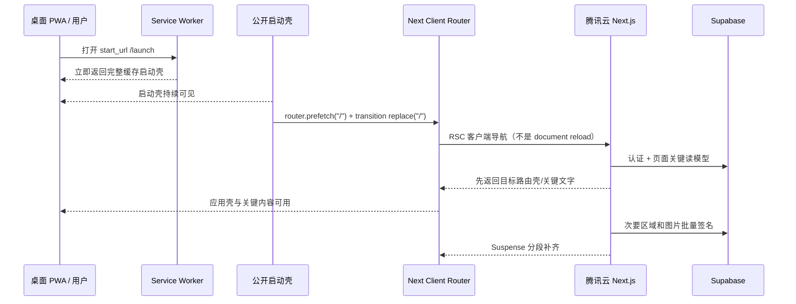
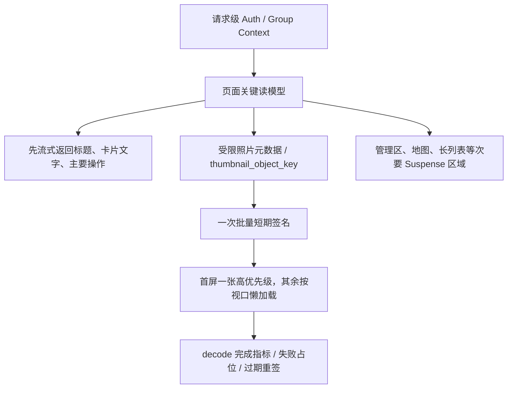

# 食迹 Foodprint｜V2.2 启动、跳转与私有图片性能开发交接

> 状态：**开发交接稿，待项目负责人确认后进入编码；本文档本身不代表 V2.2 已实现或已验收**  
> 日期：2026-08-10  
> 建议工作分支：`codex/v2-2-perceived-performance-media`  
> 正式入口：`https://foodprint.com.cn`  
> 前置文档：[V2.1 低延迟与用户体验开发交接](./FOODPRINT_V2_1_PERFORMANCE_UX_DEVELOPMENT_HANDOFF_2026-08-06.md)  
> 架构边界：[V2 域名运行环境与数据平面边界](./decisions/2026-08-05-v2-domain-runtime-and-data-plane-boundary.md)  
> 发布约束：[RELEASE_SOP](./RELEASE_SOP.md)、[SECURITY_COMPLIANCE_BASELINE](./SECURITY_COMPLIANCE_BASELINE.md)

## 0. 执行摘要

V2.1 已经增加公开启动壳、根级 loading、页面 pending、首页查询上限和性能日志，但真实使用仍然出现：

- 从桌面 PWA 打开后约 10 秒白屏或长时间无可用内容；
- 底部导航、地点卡片和不同页面之间跳转慢；
- 餐厅卡片、饭后聊和地点详情中的用户照片加载慢；
- 用户很难感知 V2.1 前后有明显差异。

这不是一个“再加一个 Spinner”就能解决的问题。当前代码中存在四条会直接抵消 V2.1 收益的关键链路：

1. `/launch` 虽然可以被缓存，但 120ms 后使用 `window.location.replace("/")` 再发起一次完整文档导航；该导航又可能被 Service Worker 等待最多 8 秒。启动因此仍然是“显示启动页 → 丢弃当前文档 → 再冷加载受保护首页”。
2. 底部导航和地点链接默认 `prefetch={false}`；同时只有一个根级 `loading.tsx`。用户点击以后，目标页面的认证、成员查询、业务查询和图片签名都集中发生在点击路径上。
3. 卡片宽度只有约 78–92 CSS px，却直接下载当前最长边最高 1600px、单张最高 1.5MB 的私有 WebP；首页、饭后聊和地点详情没有独立缩略图交付链路。
4. V2.1 的指标能记录“pending 状态已经 setState”和“根布局发现 `.app-shell`”，但不能证明目标路由内容已可用、图片已解码或 PWA 白屏已经结束。因此代码可以看似完成，用户体验仍未真正达标。

此外，当前本地思源黑体文件为 **6,176,128 bytes**。虽然配置了 `font-display: swap`，它仍会在冷缓存或版本更新时与 HTML、JavaScript、CSS 和图片竞争腾讯云 5 Mbps 出口；按 5 Mbps 理论带宽计算，仅传输该文件就约需 9.9 秒，尚未计入协议和并发损耗。它不一定是白屏的唯一原因，但必须从首屏关键资源中移除。

V2.2 的核心策略是：

```text
先让稳定界面持续存在
  → 消除启动二次硬导航
  → 让导航反馈和目标骨架真实可见
  → 缩短跨环境串行请求链
  → 用私有缩略图替代小卡片原图
  → 用“内容可用 / 图片解码”指标证明效果
```

V2.2 不承诺凭文档“绝对保证所有网络都快”。它通过同设备前后基线、硬性能预算、权限回归、灰度开关和可回滚发布，把“优化有效”变成必须由证据证明的发布门禁。

## 1. 本版本的唯一问题定义

### 1.1 用户问题

用户点击、打开或滚动以后，需要尽快看到与动作对应的稳定结果：

- 打开 PWA：立即看到可持续存在的食迹启动/应用壳，不出现长时间纯白画面；
- 切换页面：100–200ms 内看到目标反馈，随后先显示目标页面结构，再补齐远程数据；
- 浏览地点：文字卡片先可读，首屏照片尽快显示，非首屏照片不抢占关键带宽；
- 网络较慢：页面有明确状态、超时和重试，不以无限等待代替错误处理。

### 1.2 工程问题

V2.2 集中解决以下工程问题：

- PWA 启动链路存在第二次完整文档导航；
- Service Worker 慢导航回退时间与用户约 10 秒白屏高度吻合；
- 页面只有根级 loading，缺少路由级骨架和真实导航完成判定；
- 高成本页面全部关闭预取，点击时才开始完整 RSC/数据请求；
- 各页面重复执行 `getUser → membership → group → page data`；
- 部分页面存在多阶段串行查询、无限或偏大的结果集和逐张签名；
- 小尺寸 UI 直接使用大尺寸私有图片；
- 全量中文字体文件过大；
- 指标没有覆盖启动壳持续时间、路由可用时间和图片解码时间。

### 1.3 版本定位

V2.2 是 V2.1 的效果修正和深化，不是视觉重做，也不是 V2-B 数据平面迁移。只有当本文件规定的应用层、媒体层和资源层优化完成后，线上指标仍证明 Supabase Auth、PostgreSQL、Storage 或 Edge Functions 是主要长尾，才另立 V2-B ADR/Spec。

## 2. 审计结论与证据等级

本节把事实、强推断和待测假设分开。开发者不得把“可能”直接写成“已解决”。

### 2.1 证据等级

| 等级 | 含义 | V2.2 处理方式 |
| --- | --- | --- |
| A｜代码确认 | 当前仓库可以直接证明 | 必须修复并增加契约测试 |
| B｜强关联 | 代码时序与用户现象高度吻合，但缺少真实设备瀑布图 | 先埋点，再修复并做同设备 A/B |
| C｜待测量 | 可能受生产网络、系统或第三方影响 | 不先购买或迁移；先记录分段指标 |

### 2.2 当前问题树

| 编号 | 证据等级 | 当前事实 | 用户影响 | 主要依据 |
| --- | --- | --- | --- | --- |
| R1 | A | manifest 的 `start_url` 是 `/launch`，但 `LaunchGate` 在 120ms 后调用 `window.location.replace("/")` | 缓存启动页之后仍发生完整文档冷导航，当前 DOM、React 状态和已绘制内容不能作为持续应用壳 | `src/app/manifest.ts`、`src/components/pwa/launch-gate.tsx` |
| R2 | A/B | Service Worker 对非 `/launch`、`/offline` 的 document navigation 使用 8,000ms 网络等待，再回退到缓存壳 | 慢但未失败的网络可产生接近 8–10 秒的无结果等待；与用户反馈高度吻合 | `src/lib/pwa/service-worker-script.ts` |
| R3 | A | Service Worker 预缓存清单没有明确覆盖 `/launch` 所需的构建期 CSS/JS；字体只会在实际请求后进入运行时缓存 | 更新、缓存淘汰或离线启动时，启动壳是否完整可用没有被自动化证明 | `src/lib/pwa/service-worker-script.ts` |
| R4 | A | `PendingNavigationLink` 默认 `prefetch=false`；底部五个入口全部使用该默认值 | 所有目标页工作都从点击时才开始，pending 只改变当前链接局部文案 | `src/components/shell/pending-navigation-link.tsx`、`src/components/shell/app-shell.tsx` |
| R5 | A | 仅有 `src/app/loading.tsx`，没有 `/try`、`/mark`、`/activity`、`/admin`、`/place/[id]` 的路由级 loading | 目标页结构和真实业务阶段不可区分；重页面容易表现为同一个通用等待页 | `src/app/loading.tsx` |
| R6 | A | 当前 `navigation_pending_feedback` 测量的是点击到 pending 状态 effect；`pwa_app_interactive` 只检查 `.app-shell` 是否存在 | 指标可以很快，但目标页数据、控件和图片仍可能未完成 | `src/components/performance/performance-observer.tsx`、`src/components/shell/pending-navigation-link.tsx` |
| R7 | A | 首页卡片使用原始 `object_key` 的签名 URL，原始上传允许最长边 1600px、单张 1.5MB；卡片显示宽约 78–92px | 网络传输、图片解码和内存成本远大于 UI 需要 | `src/components/mark/photo-picker.tsx`、`src/lib/discovery/server.ts`、`src/components/discover/discovery-place-card.tsx` |
| R8 | A | 首页卡片原生 `` 没有显式 `loading`、`decoding`、准确 width/height、首屏优先级和加载失败状态 | 首屏和非首屏图片竞争，图片到达前卡片反馈不足 | `src/components/discover/discovery-place-card.tsx` |
| R9 | A | 饭后聊和地点详情对照片逐张调用 `createSignedUrl`，之后才返回整页 | 照片越多，Storage 签名扇出和服务端等待越明显 | `src/app/activity/page.tsx`、`src/app/place/[id]/page.tsx` |
| R10 | A | `/activity`、`/try`、`/mark`、`/admin`、`/place/[id]` 都各自重复认证和成员/小组读取，并含多阶段串行查询 | 每次页面切换都重新支付跨腾讯云与 Supabase 的远程 RTT | 对应 `src/app/**/page.tsx` |
| R11 | A | 活动流、地点详情、候选列表和管理页部分结果没有分页或把大量次要数据放在首个响应中 | 数据随使用增长，首屏延迟会继续恶化 | 对应页面与 RPC migration |
| R12 | A/C | 本地 Source Han Sans SC WOFF2 为 6,176,128 bytes；生产出口已记录为 5 Mbps | 冷缓存和升级后可能长期占用关键带宽；是否直接阻塞 FCP 需瀑布图确认 | `public/fonts/source-han-sans-sc-v2.005.woff2`、`src/app/globals.css`、V2-A/V2.1 运行记录 |
| R13 | C | 生产是否启用 HTTP/2、压缩、连接复用，以及 DNS/TLS/Supabase 各阶段长尾没有形成可复现的发布对比 | 可能仍有入口或基础设施瓶颈，但当前不能凭体感归因 | Nginx 配置与线上环境待测 |

### 2.3 为什么 V2.1 用户感知不明显

V2.1 的几个决定在当时是合理的风险控制，但组合后产生了新的体验缺口：

- 启动壳解决了“没有公开可缓存页面”，却用硬跳转进入真实应用，因此没有消除第二次冷导航；
- 关闭重页面预取减少了首页后台请求，却把全部等待移动到了点击之后；
- 根 loading 提供了统一反馈，却没有把各页面的首要内容与次要管理/图片数据拆开；
- 首页查询设置了上限和并行阶段，但其他核心路由仍有重复认证、串行查询和逐张签名；
- 记录了“有反馈”，却没有记录“用户想看的内容什么时候真的可用”。

所以 V2.2 不回退 V2.1 的隐私和安全边界，而是修正启动、预取、流式渲染、媒体规格和指标定义。

## 3. 统一性能术语

后续代码、日志和验收必须使用同一组定义，禁止用“页面加载完成”泛指不同阶段。

| 名称 | 精确定义 |
| --- | --- |
| PWA 冷启动 | 从系统任务切换器移除 PWA、等待至少 30 秒后，从桌面图标打开；记录 Service Worker 是否已有 controller/cache |
| PWA 暖启动 | PWA 最近 5 分钟内使用过，从后台或桌面图标重新进入 |
| 空白帧 | 应用窗口已可见，但没有启动壳、应用壳、骨架、错误或离线内容，仅有纯色背景 |
| 启动壳可见 | `/launch` 的品牌和状态节点已经绘制；用 FCP、元素标记和录屏交叉验证 |
| 应用壳可见 | Header、页面主体容器和底部导航已经绘制；不等于首页数据可用 |
| 路由反馈 | 点击/键盘激活导航到 pending、目标骨架或状态发生可见变化 |
| 路由壳可见 | 目标路由专属标题和结构已绘制，不要求所有数据完成 |
| 关键内容可用 | 该页面最主要的文本/操作已经显示并可操作；由每个页面显式放置 `ContentReadyMarker` |
| 图片可见等待 | 图片进入视口到 `HTMLImageElement.decode()` 完成的时间 |
| 首屏图片 | 启动时一个视口内实际可见或距视口不超过 200px 的图片 |
| 非首屏图片 | 首屏定义之外的图片；不得抢占高优先级网络 |

## 4. 目标、性能预算与发布红线

### 4.1 版本目标

#### G1｜消除 PWA 启动二次冷导航

缓存启动壳显示后，通过 Next.js 客户端路由过渡进入真实入口，当前壳持续存在，禁止定时自动 `window.location.replace("/")`。

#### G2｜让页面跳转先有目标结构，再有完整数据

底部导航和地点详情在用户动作后立即显示全局反馈，并在远程数据未完成时显示对应页面骨架；重数据区域通过 Suspense 分段返回。

#### G3｜压缩真实等待，而非只改善动画

建立一次请求内复用的认证/小组上下文；为主要页面限制顺序阶段、结果数和签名调用；把次要管理区、地图和媒体移出关键路径。

#### G4｜建立适合小尺寸 UI 的私有图片链路

新上传照片生成私有缩略图；旧照片可幂等回填；卡片、饭后聊和三列图库使用缩略图，完整显示图只在明确需要时加载。

#### G5｜每次发布能证明“用户真的更快”

同时记录启动壳、应用壳、关键内容、导航完成和图片解码；所有预算必须有同设备、同网络、同账号场景的前后样本。

### 4.2 硬性能预算

以下预算用于正式发布门禁。样本必须来自中国大陆真实网络；本地和模拟慢网只用于调试。

| 场景 | p75 目标 | p95 上限 | 超限行为 |
| --- | ---: | ---: | --- |
| PWA 冷启动 → 启动壳可见 | ≤ 0.8s | ≤ 1.5s | 阻止关闭 V2.2 |
| PWA 窗口可见后的连续空白帧 | ≤ 0.2s | ≤ 0.5s | 任何单次 >2s 视为严重回归 |
| 启动壳 → 应用壳可见 | ≤ 1.2s | ≤ 2.5s | 超时继续保留启动壳并显示可重试状态 |
| PWA 冷启动 → 首页关键文字可用 | ≤ 3.5s | ≤ 6.0s | 6s 时必须有非空错误/重试，不允许纯等待 |
| 底部导航 → 可见反馈 | ≤ 100ms | ≤ 200ms | 阻止发布 |
| 底部导航 → 目标路由壳 | ≤ 300ms | ≤ 600ms | 超限必须显示当前页持续状态或目标骨架 |
| 常用路由 → 关键内容可用 | ≤ 2.0s | ≤ 4.0s | `/admin` 可放宽至 p75 2.5s / p95 5s |
| 首张可见地点缩略图进入视口 → 解码 | ≤ 1.2s | ≤ 2.5s | 失败时 3s 内显示可理解占位和一次重试 |
| 图片导致的 CLS | ≤ 0.05 | ≤ 0.10 | 超限阻止发布 |

### 4.3 资源和请求预算

| 项目 | V2.2 预算 |
| --- | --- |
| 首屏本地 Webfont | 不得请求当前 6.18MB 全量字体；首屏实际传输的本地字体合计目标 ≤ 300KB |
| 新照片缩略图 | WebP；最长边目标 640px；单张硬上限 120KiB |
| 新照片显示图 | WebP；最长边目标 1280px；单张硬上限 600KiB；不再生成接近 1.5MB 的常规展示图 |
| 首屏照片总字节 | 发现页首屏目标 ≤ 480KiB；同一时刻最多 1 张 `fetchpriority=high` |
| 非首屏照片 | 默认 lazy；未接近视口不得主动下载 |
| Storage 签名 | 每个页面阶段最多一次批量 `createSignedUrls`；禁止 N 张照片 N 次 `createSignedUrl` |
| 路由远程顺序阶段 | proxy 之后，常用路由关键内容最多 3 个串行远程阶段；次要区域另行流式加载 |
| 列表首批 | 发现 20、活动 20、候选 30、地点时间线 20、地点图库 12；继续浏览使用游标分页 |
| JS/CSS | 建立真实 baseline 后，任何主路由压缩传输量不得无说明增长 >10% |

### 4.4 发布红线

满足任一项即不得发布或不得标记完成：

- 仍存在自动 `window.location.replace("/")` 或自动 `window.location.reload()` 的启动路径；
- Service Worker Cache Storage 出现私有 HTML、RSC、API、Auth、签名 URL、用户照片或地图数据；
- 为提升速度绕过认证、RLS、邀请、成员状态或 Owner/Admin/Member 权限；
- 地点卡片仍默认下载 canonical/原大图；
- 活动流或详情页仍逐张签名；
- 只报告 Spinner/pending 出现时间，不报告目标内容完成时间；
- 没有同设备前后数据就宣称“性能问题已解决”；
- 自动化 `lint/typecheck/test/build` 未通过却把结果写成通过。

## 5. 非目标与不可越过的边界

- 不在 V2.2 中重做品牌视觉、信息架构、推荐规则、评价模型或小组治理。
- 不把 Supabase Auth、PostgreSQL、Storage、RLS、RPC 或真实照片整体迁入腾讯云；这仍需 V2-B 独立立项。
- 不将私有用户图片改为公开 bucket、公开 CDN URL 或永久 URL。
- 不把登录后页面、RSC、API 响应、签名 URL或用户照片写入 Service Worker Cache Storage。
- 不延长签名 URL 有效期来掩盖加载问题；默认仍为 15 分钟，过期通过重新授权签名处理。
- 不删除现有 canonical 照片；缩略图回填必须是可逆的附加操作。
- 不以无限预取替代优化；预取必须有意图、并发和弱网边界。
- 不因字体子集缺字而改变用户生成内容；缺失字形必须回退到系统中文字体。
- 不在生产服务器直接手改源码、migration 或对象存储数据。

## 6. 目标架构

### 6.1 启动与页面切换



### 6.2 页面数据和私有媒体



### 6.3 不变的安全边界

- 启动壳公开且无用户数据；真实页面继续由 Supabase Auth、RLS 和页面权限保护。
- 客户端不得提交可信的 `userId`、`groupId`、role 或任意 Storage object key；服务端从当前会话和数据库关系推导。
- 图片缩略图与 canonical 图在同一个私有 `place-photos` bucket 和同一小组/用户目录边界内。
- 页面只拿短期签名 URL；数据库永久保存 object key，不保存签名 URL。
- 成员退出、暂停、移除、图片隐藏或软删除后，新签名必须立即拒绝；已经签发的 URL 最多保留既有 15 分钟窗口，不扩大。

## 7. P0-A｜修正 PWA 启动链路

### 7.1 替换硬导航

修改 `LaunchGate`：

1. 使用 `useRouter()`；组件挂载后先记录 `pwa_boot_navigation_start`；
2. 在线时调用 `router.prefetch("/")`，随后在 `startTransition` 中 `router.replace("/")`；
3. 客户端路由完成前保持 `/launch` 当前内容，不主动清空 body，不显示全白遮罩；
4. 2.5 秒仍未出现应用壳时把文案切换为“网络响应较慢，正在继续连接”；
5. 6 秒仍未出现关键内容时显示“重试进入食迹”和离线说明；
6. 自动流程禁止调用 `window.location.replace`、`location.href` 或 `location.reload`；
7. 只有用户明确点击“强制重新连接”且客户端路由已判定失败时，才允许一次完整导航，并记录原因。

`/launch` 作为公开路由不得创建 Supabase client、不得读取 Cookie 内容、不得输出小组名或用户信息。

### 7.2 Service Worker 导航策略

保持“只缓存公开壳和静态资源”的原则，并修改以下行为：

- `/launch`、`/offline` 继续 cache-first；
- PWA 正常启动通过客户端 RSC 导航进入 `/`，不再依赖 document navigation 的 8 秒网络等待；
- 对外部打开的深链接 document navigation 设置 **3 秒软回退目标**，最终值必须由基线确认，范围不得超过 4 秒；
- 回退页必须在当前 URL 下正确显示目标路径的重试，不得假装已经进入私有页面；
- RSC、Server Action、`/api/*`、Supabase、图片和签名 URL全部不进入 Cache Storage；
- cache 名继续包含 deployment/build version；激活时只删除旧的 `foodprint-shell-*`；
- 首次 controller 接管不自动刷新；更新仍由用户确认；
- 增加离线完整性测试，证明 `/launch` 在断网时有 CSS、必要图标和可用状态，而不是只有 HTML。

### 7.3 启动壳依赖完整性

Service Worker install 不能只缓存 `/launch` HTML 后假设其构建资源一定存在。实现时二选一，但必须用离线 E2E 证明：

- 方案 A（优先）：构建时生成公开 shell asset manifest，把 `/launch` 实际需要的版本化 CSS/JS/图标加入预缓存；
- 方案 B：将 `/launch` 做成不依赖大体积构建 chunk 的最小公开壳，关键 CSS 内联，仍通过受控客户端脚本进入 Next Router。

不得通过缓存完整 `/` 私有 HTML来解决依赖问题。

### 7.4 深链、离线与更新场景

必须覆盖：

- 已登录/未登录从桌面打开；
- 首次安装后的第一次打开；
- Service Worker 已存在但 shell cache 被部分清理；
- 从消息或浏览器直接打开 `/place/:id`；
- 断网启动、慢网启动、启动过程中恢复网络；
- 新 Service Worker waiting、用户确认更新、更新后第一次启动；
- PWA 在后台 30 分钟和 24 小时后恢复。

### 7.5 区分系统启动画面与网页白屏

桌面图标点击到 FCP 之前可能包含操作系统/WebView 自己的启动画面，JavaScript 指标无法覆盖。验收必须用录屏把以下阶段分开：图标点击 → 系统启动面 → WebView 首帧 → `/launch` FCP → 应用壳。

- `html`、`body`、manifest `background_color`、theme color 和 `/launch` 首屏背景保持同一非白色品牌底色；
- 如果 iOS 真机证明白色发生在网页 FCP 之前，再为实际支持的设备尺寸增加公开、轻量的 `apple-touch-startup-image`；不得在没有设备证据时批量生成几十张无验证资产；
- Android/桌面 Chromium 同样检查 manifest 背景和窗口恢复画面；
- 启动画面只含公开品牌资产，加入公开静态资源预算和离线检查；
- 系统启动阶段和网页阶段分别报告，不能把 OS 白屏误归因为 Supabase，也不能用网页指标掩盖 OS 启动画面。

## 8. P0-B｜移除首屏大字体竞争

### 8.1 当前问题

`public/fonts/source-han-sans-sc-v2.005.woff2` 当前为 6,176,128 bytes，且全站 body 默认使用它。`font-display: swap` 能减少字体对首次绘制的直接阻塞，但不能消除下载、缓存淘汰、连接占用和 5 Mbps 带宽竞争。

### 8.2 目标方案

- 从代码中的固定 UI 文案生成可复现的 Source Han Sans SC UI 子集；包含常用数字、拉丁字符、中文标点、全站固定按钮/标题/状态文案；
- 子集文件使用版本化名称，例如 `source-han-sans-sc-ui-v2-2.woff2`；
- `@font-face` 只覆盖子集中的 glyph，用户昵称、餐厅名、地址、评论和其他动态文字缺字时逐字回退到 `PingFang SC`、`Hiragino Sans GB`、`Microsoft YaHei`、system-ui；
- 保留字体授权文件和子集生成说明；生成结果提交仓库，CI 不依赖生产时动态下载字体；
- 新子集目标 ≤300KB；如超过，必须给出字符清单和原因；
- 当前 6.18MB 文件在 CSS 不再引用且真机无缺字后才能从公开部署产物移除；不得先删除再验证；
- ZCOOL 小薇体当前子集约 8KB，可保留，但仍纳入资源预算。

### 8.3 字体验收

- 320/375/390/430px 宽度检查固定中文 UI；
- 检查生僻餐厅名、英文、数字、emoji、繁简混合和用户评论；
- Chrome DevTools/真实设备瀑布图不得再请求 6.18MB 文件；
- fallback 不能产生方框、不可读字形或明显布局跳动；
- 字体变化不能改写 V1.4 已批准的视觉层级和品牌字体用途。

## 9. P0-C｜统一导航协调、意图预取与路由骨架

### 9.1 修正 pending 的生命周期

新增一个全局、轻量的客户端 `NavigationCoordinator`，至少维护：

- `fromRoute`、`toRoute`、`startedAt`；
- 导航来源：bottom-nav、place-card、back、programmatic；
- 当前状态：intent、pending、shell-visible、content-ready、error；
- 防止重复点击和同一路由重复导航；
- pathname/searchParams 改变后，在下一次绘制记录 `navigation_route_committed`；
- 目标页的 `ContentReadyMarker` 挂载后记录 `navigation_content_ready` 并清除 pending；
- 10 秒安全上限，超时清除永久 pending 并显示重试，不让状态卡死。

当前 `navigation_pending_feedback` 可以保留为“反馈耗时”，但不得再作为“页面完成”指标。

### 9.2 意图预取策略

不恢复“所有 Link 无条件预取”，改为受控策略：

- 鼠标 `pointerenter`、键盘 `focus`、触屏 `pointerdown/touchstart` 时调用 `router.prefetch(href)`；
- 每个 href 在一次页面生命周期最多预取一次；
- 同时最多一个主动预取；用户真正点击的导航优先于预取；
- 浏览器声明 `saveData=true` 或可判断为极慢连接时跳过非必要预取；该 API 不可用时不影响正确性；
- 页面空闲后最多预取一个最可能的相邻主导航，不允许一次预取五个重页面；
- 管理页的 Owner-only 次要面板、地图、照片和长列表不得因为路由预取一起加载；
- 记录 prefetch 命中、取消和未命中，但不记录用户身份。

### 9.3 路由级 loading 与错误边界

新增并定制：

- `src/app/try/loading.tsx`；
- `src/app/mark/loading.tsx`；
- `src/app/activity/loading.tsx`；
- `src/app/admin/loading.tsx`；
- `src/app/place/[id]/loading.tsx`；
- 必要时对应 `error.tsx`。

每个 loading 必须：

- 保留 Header、底部导航、背景色和稳定尺寸；
- 展示目标页自己的标题/卡片结构，不使用纯白全屏；
- `aria-busy` 与可读状态正确；
- 遵循 `prefers-reduced-motion`；
- 不显示上一小组的私有数据快照；
- 不因骨架高度变化造成明显 CLS。

### 9.4 返回与滚动状态

- 地点详情返回发现页继续保留 `returnTo`、筛选、排序和滚动位置；
- 浏览器 back/forward 不得触发永久 pending；
- 快速连续点击两个导航时，最后一次用户意图胜出，旧请求结果不得覆盖新路由；
- 当前激活导航再次点击只允许滚动到顶部或无操作，不重新请求整页。

## 10. P1-A｜请求级认证与小组上下文

### 10.1 统一上下文

建立 `getActiveGroupContext()` 请求级 helper，返回：

```ts
type ActiveGroupContext = {
  userId: string;
  groupId: string;
  role: "owner" | "admin" | "member";
  groupName: string;
};
```

规则：

- 每个 RSC 请求只创建一个 Supabase server client；
- `auth.getUser()` 仍是服务器身份事实，除非单独的安全评审和真实指标证明可安全替代；
- 成员关系和 group name 在一次受控查询/RPC 中读取；
- 使用 React 请求级 memoization 时必须证明不会跨请求、跨用户或跨小组复用；
- helper 不做跨请求的全局缓存，不把 session、用户或小组数据写入 `unstable_cache`；
- 页面、Server Action 和 RPC 仍独立做其需要的授权，客户端传入的 group/role 不可信。

### 10.2 推荐数据库读模型

跨腾讯云与 Supabase 的 RTT 是当前常用路由成本之一。V2.2 允许新增**向前兼容、显式校验成员身份**的 read RPC，以减少多张表的远程往返；不允许修改已上线 migration。

建议新增：

- `get_active_group_context_v2()`：基于 `auth.uid()` 返回当前有效 group、role、group name；
- `list_discovery_cards_v2(...)`：返回首批地点卡片文字、统计、标签、wishlist 和缩略图 object key；
- `list_group_visit_feed_v2(p_limit, p_cursor)`：返回分页活动文字和每条最多两张缩略图 object key；
- `get_group_place_detail_v2(p_group_place_id, p_timeline_limit)`：返回地点核心信息、权限、汇总和分页时间线；图库可独立查询并流式返回；
- 只在测量证明必要时为 try/admin 建立专用 RPC，避免为“少写几行 TypeScript”创建巨大万能函数。

所有 `SECURITY DEFINER` RPC 必须：

- `set search_path = public`；
- 第一层使用 `auth.uid()` 和有效成员关系确认访问范围；
- 不信任调用方传入的 user/group/role；
- `revoke all ... from public, anon`，只给需要的 authenticated/service role；
- 有匿名、未登录、已移除成员、跨组成员、Member、Admin、Owner 测试；
- 有明确 limit/cursor，禁止无上限结果；
- 只返回 UI 使用字段，不返回邮箱、token、object key 以外的内部存储信息或审计敏感字段。

### 10.3 查询阶段预算

常用页面在 proxy 之后的关键路径目标：

```text
阶段 1：getUser / session fact
阶段 2：active-group context + 页面核心 read model
阶段 3：如首屏必须有照片，最多一次批量签名
```

次要区域必须并行或放入 Suspense，不得继续把“管理列表、全部照片、全部时间线、地图数据”塞进阶段 2。

## 11. P1-B｜逐路由改造清单

### 11.1 `/` 发现页

当前关键问题：先取 `group_places`，再发起 8 组并行查询，随后查询 scene tags，再批量签名；同时一次最多读取 120 个地点和 12 个原图封面。

改造：

- read model 首批返回 20 个卡片和游标；筛选/排序采用服务端参数或明确的分页合并，不再依赖一次加载全部地点；
- 列表模式只取卡片需要字段；地图点位在用户切换地图时单独加载，最多 120 点；
- read model 返回 `thumbnail_object_key`，不在核心文字查询里等待签名；
- 先流式绘制真实卡片文字和固定照片占位，再由一个异步媒体区完成一次批量签名；
- 首屏只给第一张图片 `fetchpriority="high"`，其余 eager/lazy 按可见位置处理；
- 筛选改变时取消/忽略旧请求，保留当前列表直到新结果骨架出现；
- wishlist 继续按当前 user 隔离，不做跨用户缓存。

### 11.2 `/activity` 饭后聊

当前关键问题：活动 RPC 返回最多 30 条后，再查全部照片，并逐张签名。

改造：

- `list_group_visit_feed_v2` 首批 20 条，使用 `(created_at, id)` 稳定游标；
- 每条首批最多返回两张 thumbnail object key；更多照片只在地点详情显示；
- 所有缩略图一次批量签名；禁止 `Promise.all(createSignedUrl)`；
- 先显示活动文字，照片条在独立 Suspense/客户端媒体层补齐；
- 图片横条固定 104×104 CSS px，使用缩略图、`loading="lazy"`、`decoding="async"`；
- “加载更多”失败只影响后续页，不清空已显示内容。

### 11.3 `/place/[id]` 地点详情

当前关键问题：认证、groupPlace、group、membership 串行；之后 7 个查询并行；再逐张签名；最后再查 scene tags。页面必须等待完整链路。

改造：

- 用请求级 context 和 `get_group_place_detail_v2` 合并核心授权/地点/汇总/时间线；
- 首屏优先返回返回按钮、地点名、地址、导航、推荐强度和主要操作；
- 图库独立 Suspense，首批最多 12 张缩略图并一次批量签名；
- 时间线首批 20 条，文本先显示；照片条只取每条最多两张缩略图；
- canonical 图只在未来明确的单图查看/放大动作中加载，当前三列图库和 88px 时间线不使用 canonical；
- 页面不存在、地点归档、成员无权访问分别保持正确 404/权限行为；
- 返回发现页保持筛选和滚动位置。

### 11.4 `/try` 去试试

当前关键问题：认证、membership、group、candidates 串行；候选列表无明确上限，然后再读取 place/profile/business area。

改造：

- 使用统一 context；group header 不再单独查询；
- 首批 30 条候选，稳定游标分页；
- 候选、place、creator display name 和 business area 使用一次 read model 或有上限的并行阶段；
- 附近搜索和地图继续按用户动作加载，不进入路由首屏；
- 预取只取候选文字壳，不触发地点搜索或地图资源。

### 11.5 `/mark` 记一顿

当前关键问题：基础 context 后，place 分支串行读取 groupPlace → place → opinion；candidate 分支又重复 membership，再查候选归属和 place。

改造：

- 统一 context，删除 candidate 分支第二次 membership；
- `place` 与 `candidate` 参数互斥并经过 schema 验证；
- 用 join/read RPC 一次解析目标地点和当前观点；
- 没有目标时先显示搜索表单，不等待与搜索无关的数据；
- 图片处理/上传进度与页面导航进度分开，不把 CPU 压缩显示为“页面卡死”；
- 保存成功后的 revalidate 保持现有正确性，不用全页硬刷新。

### 11.6 `/admin` 我的

当前关键问题：页面在首个响应中等待成员、全部 groupPlaces、五组个人数据、邀请和五个管理 RPC；Member 也会等待个人列表完整组装。

改造：

- 首个阶段只返回 group header、role、安装入口和个人列表摘要；
- `PersonalPlaceLists` 首批各 10 条，按需展开；
- Owner 成员目录、邀请记录、内容管理、候选管理、发现补全和商圈回填分别放入权限控制后的 Suspense 区域；
- Member 不发起 Owner/Admin 查询；Admin 不发起 Owner-only 成员邮箱查询；
- 管理列表继续 limit/cursor，不以一次 50×多列表作为首屏完成条件；
- 次要面板失败显示局部错误，不使整个“我的”页面失败。

## 12. P1-C｜私有照片缩略图数据模型

### 12.1 采用附加 thumbnail 字段，不替换 canonical

V2.2 选择对 `photos` 表增加可空 thumbnail 元数据，而不是迁移或删除现有 `object_key`：

```sql
alter table public.photos
  add column thumbnail_object_key text,
  add column thumbnail_width integer,
  add column thumbnail_height integer,
  add column thumbnail_size_bytes integer,
  add column thumbnail_generated_at timestamptz;
```

正式 migration 还必须加入：

- thumbnail object key 唯一约束和 1–800 字符约束；
- width/height 1–2000，size 1–122880 bytes；
- “五个 thumbnail 字段全部为空，或全部有效”的一致性 check；
- 适合 `thumbnail_object_key is null` 回填扫描的部分索引；
- 对 `enforce_photo_rules()` 的向前兼容更新：普通 authenticated 更新不能替换 canonical 或 thumbnail 元数据；缩略图回填只能通过受控 `SECURITY DEFINER` RPC/后台任务；
- 新上传照片 insert 时允许一次性登记 canonical 与 thumbnail，但服务端必须验证两者属于当前用户和当前小组目录；
- 任何新增 RPC 的 revoke/grant 和 RLS 测试。

不得修改 `20260723113000_phase3_private_photos.sql` 等历史 migration；新增独立 V2.2 migration。

### 12.2 对象路径

新照片使用稳定、可审计路径：

```text
groups/{groupId}/users/{userId}/visits/{visitRecordId}/photos/{photoId}/display.webp
groups/{groupId}/users/{userId}/visits/{visitRecordId}/photos/{photoId}/thumb.webp
```

服务端生成 `photoId`，从 session/context 推导 group/user；客户端不能自报可信路径。Storage 继续使用 private `place-photos` bucket，现有成员读、本人上传/删除边界不放宽。

### 12.3 新上传处理

复用当前浏览器 Canvas 去 EXIF 思路，但改成一次解码生成两份：

- display：最长边 1280px，WebP，质量从约 0.78 开始，逐级压缩到 ≤600KiB；
- thumb：最长边 640px，WebP，质量从约 0.72 开始，逐级压缩到 ≤120KiB；
- 不放大原本较小的图片；
- 保留正确方向和宽高；
- 每张 display/thumb 必须一一对应；数量、MIME、字节和尺寸在 Server Action 再验证；客户端 hidden input 只能作为提示，服务端必须检查文件 magic bytes，并用经过验证的解码器/元数据解析器确认真实尺寸和像素上限，不能信任文件名、`File.type` 或客户端声明尺寸；
- 9 张照片的 display+thumb 总请求必须保持低于现有 16MB body limit；超过时在客户端明确提示，而不是让 Nginx/Next 返回模糊错误；
- 上传并发限制为 2–3，避免 18 个对象同时占满连接；
- Storage 上传成功、数据库登记失败时删除本次两个对象；thumbnail 上传失败时 canonical 可以保存，但必须返回“照片已保存，缩略图待补齐”的局部 warning；
- 不把上传失败重试设计成重复创建照片记录；使用 `photoId` 保证幂等。

如果实现需要引入原生图片处理库，必须先在生产 Docker standalone 和腾讯云架构上通过安装、构建、内存和 9 图压力测试；未经验证不得把本机可运行当作生产可用。

### 12.4 旧照片回填

新增受控脚本，例如 `scripts/backfill-photo-thumbnails.mjs`，要求：

- 使用只存在于受控运行环境的 service role，密钥不进入仓库、日志、浏览器或命令历史；
- 默认 dry-run，按 `photos.id` 游标分页，每批 20，并发最多 2；
- 只处理 `deleted_at is null`、`hidden_at is null`、`thumbnail_object_key is null`；
- 下载 canonical → 生成 thumb → 上传 → 调用受控 RPC 登记；
- 每一步可重试、幂等；已存在对象和数据库行不重复覆盖；
- 失败记录只保留 photo ID、阶段和脱敏错误分类，不记录签名 URL、object key 全路径或用户身份；
- 回填前后核对行数、成功数、失败数、总新增字节；
- 不删除或改写 canonical；停止脚本即停止影响，应用仍可回退原图；
- 先对测试小组/少量照片执行，再全量；失败率 >1% 或任一跨组权限异常立即停止。

### 12.5 删除、隐藏和退出成员

- `deleteMyPhoto` 改为受控 RPC 先原子校验作者并软删除记录、返回 canonical + thumbnail keys，再清理 Storage；这样 Storage 失败不会留下仍在 UI 可见但文件已消失的照片；
- Storage 清理失败时向用户返回“内容已隐藏，文件清理待重试”的 warning，并由受控清理脚本重试；在清理完成前不得把该状态误记为完全删除成功；
- `delete_my_visit_record` 返回的 object key 集合同时包含 thumbnail；
- hide photo/visit 后，新签名查询立即排除对应照片；
- 退出、暂停、移除成员不能再获取任何新 thumbnail URL；
- 旧签名 URL 的有效窗口不超过既有 15 分钟；不为缩略图放宽；
- 孤儿对象审计脚本能找出“Storage 有对象、DB 无记录”和“DB 有 key、Storage 无对象”，只报告，不自动删除，除非项目负责人另行批准。

## 13. P1-D｜私有图片交付组件

### 13.1 统一 `PrivatePhoto`

新增可复用组件，替换发现卡片、活动流、地点图库和时间线中的裸 ``。至少支持：

- 明确 `width`、`height` 和 CSS `aspect-ratio`，图片到达前保持布局；
- `loading="lazy"`、`decoding="async"`；仅首屏第一张允许 eager + high priority；
- placeholder、loaded、error、retry 四种状态；
- 图片进入视口、请求开始、load、decode、error 指标；
- `img.decode()` 不支持或 reject 时安全回退到 load 事件；
- 过期/403 时最多重新授权签名一次，防止无限循环；
- `alt` 继续使用餐厅名和内容语义；装饰图保持空 alt；
- 组件卸载后取消观察和定时器。

### 13.2 签名策略

- 首屏媒体元数据由服务端授权；同一页面阶段将 object keys 一次传给 `createSignedUrls`；
- read RPC 返回的 object keys 只在 Server Component/loader 内使用，不作为普通客户端组件 props 暴露；浏览器只接收必要的短期签名 URL或 photo ID；
- object key 不由浏览器回传决定，重新签名 API 只接收 photo IDs，服务端通过当前 session + RLS 查询可见照片并选择 thumbnail key；
- 重签接口每次最多 20 个 ID、schema 校验、`Cache-Control: no-store`、受现有 API 限速；
- 返回结果按 photo ID 映射，禁止把 object key、provider URL 或内部错误写入日志；
- URL 只保存在当前组件内存/RSC payload，不写 localStorage、IndexedDB、Service Worker 或数据库；
- Activity/Place 禁止逐张 `createSignedUrl`；空或失败项显示占位，不阻塞文字。

对确有首屏私有图片的路由，可以只对经过白名单解析的 Supabase Storage **origin** 做一次条件式 `preconnect`，不得预连接完整签名 URL。该优化必须用 DNS/connect 指标证明有效；无图片页面、弱网/save-data 场景不主动建立无用连接。

### 13.3 为什么 V2.2 不直接启用 Next Image Optimizer

私有签名 URL 经 `_next/image` 代理可能改变缓存、日志、过期和成员撤销边界。V2.2 默认继续使用原生 `` + 私有缩略图，不把签名照片送入共享优化缓存。只有独立安全评审证明：缓存键、TTL、日志、成员撤销、跨组隔离和生产带宽都正确，才可另行启用同源图片代理。

## 14. P1-E｜可观测性必须测到真实完成

### 14.1 修正客户端指标

扩展受控枚举，至少包括：

| 指标 | 起点 | 终点 |
| --- | --- | --- |
| `pwa_launch_shell_visible` | navigation start | `/launch` 首次绘制 |
| `pwa_boot_navigation_start` | LaunchGate 开始进入真实入口 | 同一时刻记录值 0/mark |
| `pwa_app_shell_visible` | boot navigation start | 应用壳下一帧可见 |
| `pwa_home_content_ready` | boot navigation start | 首页 `ContentReadyMarker` 挂载并绘制 |
| `navigation_feedback_visible` | 用户激活 Link | pending/目标骨架下一帧可见 |
| `navigation_route_committed` | 用户激活 Link | pathname/searchParams 提交并绘制 |
| `navigation_content_ready` | 用户激活 Link | 目标页关键内容 marker 可见 |
| `private_image_visible_to_decode` | 图片进入预加载边界 | decode 完成 |
| `private_image_error` | 图片进入预加载边界 | 首次错误/重签仍失败 |
| `private_image_signed_url_refresh` | 重签开始 | URL 返回或失败 |

维度只能使用受控枚举：route template、browser/standalone、cold/warm、first-install/update、thumbnail/display、Wi-Fi/cellular/unknown、success/timeout/error。不得记录用户 ID、group ID、餐厅名、搜索词、坐标、照片 ID/object key/URL、Cookie 或 Authorization。

客户端指标使用内存队列批量上报：最多 20 条或 2 秒刷新一次，页面隐藏时用一个 `sendBeacon` 尽力发送；指标失败不得重试阻塞导航。图片不能每张立刻发一个网络请求，发布后稳定期再根据流量降低采样率。跨域 Supabase Storage 若没有 `Timing-Allow-Origin`，不得把 `transferSize=0` 当成真实零字节；图片大小使用已授权的数据库元数据，网络体验使用进入视口到 load/decode 的耗时，不为采指标放宽 Storage CORS 或隐私边界。

### 14.2 页面关键内容定义

| 路由 | `ContentReadyMarker` 放置位置 |
| --- | --- |
| `/` | 首批真实地点文字卡片或明确空状态已绘制 |
| `/try` | 首批候选文字卡片或明确空状态已绘制 |
| `/mark` | 搜索/记录表单主要字段可操作 |
| `/activity` | 首批活动文字或明确空状态已绘制；不等待所有照片 |
| `/admin` | 身份、安装入口和个人摘要可用；不等待 Owner 管理区 |
| `/place/:id` | 地点名、地址、导航和主要操作可用；不等待图库 |

### 14.3 服务端阶段指标

每个主要 loader/RPC 至少记录：

- `route.total`；
- `auth.user`、`auth.group_context`；
- `route.core_read_model`；
- `route.secondary_data`；
- `route.photo_metadata`；
- `route.photo_sign_batch`；
- 返回数量、分页状态、success/empty/error/timeout。

日志仍只用规范化 route template。数据库错误只映射为受控类别，不输出 SQL、用户输入、签名 URL或 token。

### 14.4 基线和样本规则

- 每个关键场景改造前后使用同一设备、同一网络、同一测试小组和相近数据量；
- 每个场景至少 20 次，p95 在样本 <50 时标记“暂定”；稳定期累计到 50 次以上再作正式 p95；
- PWA cold、warm、first install、after update 分开；
- 真实网络至少包含中国大陆 Wi-Fi 和一组蜂窝网络；
- 客户端录屏、浏览器 timing、Next 结构化日志和 Nginx request/upstream time 使用同一测试时间窗；
- 禁止只挑最快样本；超时和失败也计入分位数/失败率；
- 保留 V2.1 baseline，不覆盖原始结果。

## 15. P2｜运行层与 V2-B 决策门槛

### 15.1 腾讯云/Nginx 验证

V2.2 只做可证明的运行层调整：

- 验证正式域名 ALPN/HTTP/2，而不是只看配置文件；若未启用，按当前 Nginx 版本使用兼容语法，先 `nginx -t`；
- 验证 HTML/RSC/JS/CSS 的 `Content-Encoding`、连接复用和静态缓存；
- 字体子集采用版本化路径和 immutable 缓存；不对未版本化 HTML设置长期缓存；
- 保持 `proxy_buffering off` 对 RSC 流式返回的行为，任何调整先做流式首字节对比；
- Nginx 日志继续不记录 query string、Cookie、Authorization、request body、Referer 或签名 URL；
- 检查 5 Mbps 带宽、CPU、内存和连接数是否在启动/图片高峰饱和；只有证据显示资源饱和才升级实例或带宽。

### 15.2 进入 V2-B 的量化条件

V2.2 应用、字体和缩略图全部上线并稳定观察后，满足以下任一项才提交 V2-B 提案：

- Supabase Auth + DB/RPC 在主要路由 p95 中持续占比 >60%，且绝对耗时 >2 秒；
- 私有 thumbnail 已 ≤120KiB，但中国大陆真实网络 Storage 首图 p95 仍 >3 秒或失败率 >2%；
- 腾讯云应用 CPU、内存、带宽正常，入口 TTFB 正常，但跨数据平面阶段连续 7 天超过预算；
- Edge Function/Storage 的区域性失败在两种大陆网络上可重复。

进入 V2-B 后另行评估自建 Supabase、腾讯云数据库、COS/private CDN 或混合数据平面。现有 `StorageProvider` 抽象可以作为输入，但当前并未被照片主链路实际使用，不能据此宣称 COS 已就绪。

## 16. 分阶段开发包与 PR 顺序

不得把所有改动合并为一个无法定位问题的大 PR。

### PR 0｜真实基线与指标语义修正

- 新增 content-ready、route commit、image decode 指标；
- 修正当前 `pwa_app_interactive` 和 pending 的语义；
- 采集 V2.2 前基线；
- 不改变图片 schema 和业务行为。

**门禁：** 能回答一次慢启动究竟耗在启动壳、硬导航、auth、core data、签名、图片下载、decode 还是字体。

### PR 1｜PWA 客户端启动与 Service Worker

- `router.replace` 客户端过渡；
- 启动超时/重试状态；
- 3–4 秒深链 document 回退；
- shell 依赖预缓存/最小壳；
- first install/update/offline E2E。

**门禁：** 代码和测试中自动启动不再出现 `window.location.replace("/")`；断网冷启动有完整可见壳。

### PR 2｜字体与静态资源预算

- 生成并接入 UI 字体子集；
- 增加静态资源 size budget 脚本；
- 真机缺字和瀑布图验证。

**门禁：** 首屏不请求 6.18MB 字体，固定/动态中文均可读。

### PR 3｜导航协调与路由 loading

- NavigationCoordinator；
- 意图预取；
- 五个路由 loading/error；
- back/forward、连续点击、筛选/滚动回归。

**门禁：** 反馈、route commit、content ready 三种时间可分辨；没有永久 pending。

### PR 4｜共享 context 与首页读模型

- 请求级 active group context；
- 新增 read RPC migration 和权限测试；
- 首页 20 条首批、地图延迟、文字先显示、媒体后流式；
- 查询阶段和签名批次预算。

**门禁：** 首页不再先取 120 个完整卡片并等待原图签名；跨组/退出成员测试通过。

### PR 5｜Activity / Place / Try / Mark / Admin

- 逐页按第 11 节拆分；
- 活动和详情批量签名；
- 所有长列表 limit/cursor；
- Admin 次要区 Suspense；
- Mark 去重 membership。

**门禁：** 每页关键路径远程阶段和结果数有自动化契约，次要区域失败不拖垮首屏。

### PR 6｜照片 thumbnail migration 与新上传

- 新增向前兼容 migration；
- display/thumb 双产物；
- 幂等上传、清理、删除和权限测试；
- 新照片小流量验证。

**门禁：** canonical 仍可用，thumbnail 私有且 ≤120KiB，migration 可从干净数据库重放。

### PR 7｜旧图回填与缩略图 UI 切换

- dry-run/backfill；
- `PrivatePhoto`；
- 首页、活动、详情切换 thumbnail；
- 过期重签、错误占位、decode 指标；
- 全量前小批验证。

**门禁：** 旧照片回填失败可安全回退；卡片网络请求不再使用 canonical key。

### PR 8｜生产验证、文档和稳定观察

- CI/Docker/Nginx；
- 腾讯云受控发布；
- 真机前后数据；
- 7 天错误率和性能稳定观察；
- 更新 ROADMAP、SPEC_INDEX、release note、acceptance record。

## 17. 预计文件范围

| 工作包 | 主要文件/目录 |
| --- | --- |
| PWA | `src/app/manifest.ts`、`src/app/launch/`、`src/components/pwa/launch-gate.tsx`、`src/components/pwa/pwa-register.tsx`、`src/lib/pwa/service-worker-script.ts`、`src/app/service-worker.js/route.ts` |
| 导航 | `src/components/shell/app-shell.tsx`、`pending-navigation-link.tsx`、新增 coordinator/marker、各 route `loading.tsx` / `error.tsx` |
| 指标 | `src/lib/performance/*`、`src/components/performance/*`、`src/app/api/metrics/route.ts`、Nginx 日志模板、性能脚本 |
| Context/read model | 新增 `src/lib/auth/active-group-context.ts` 或等价文件、各页面 loader、`supabase/migrations/*_v2_2_*_read_models.sql` |
| 首页 | `src/app/page.tsx`、`src/lib/discovery/server.ts`、`src/components/map/map-browser.tsx`、`src/components/discover/discovery-place-card.tsx` |
| 其他路由 | `src/app/activity/page.tsx`、`src/app/place/[id]/page.tsx`、`src/app/try/page.tsx`、`src/app/mark/page.tsx`、`src/app/admin/page.tsx` 及拆分后的 Server Components |
| 照片数据 | 新增 `supabase/migrations/*_v2_2_photo_thumbnails.sql`、`src/app/mark/actions.ts`、`src/app/place/actions.ts`、受控 backfill/audit 脚本 |
| 照片 UI | 新增 `src/components/photo/private-photo.tsx` 或等价组件，发现/活动/详情调用处，必要的受保护重签 Route Handler |
| 字体 | `src/app/globals.css`、`public/fonts/`、字体子集生成说明/脚本、资源预算脚本 |
| 部署 | `deploy/nginx/foodprint*.conf`、`deploy/README.md`、`docs/OPERATIONS.md`、发布/验收记录 |
| 测试 | `tests/v2-2-*.test.ts(x)`、必要的 browser E2E、性能基线脚本 |

实施前必须先执行 `git status --short` 并确认当前 V2.1 未提交/已有改动的归属；不得 reset、checkout 或覆盖现有工作。任何与本文件重叠的旧改动要在同一 diff 中逐项保留或明确替代。

## 18. 自动化测试要求

### 18.1 单元与静态契约

- `LaunchGate` 自动流程不包含 hard navigation；超时、离线、重试状态可测试；
- SW 只缓存公开 shell/static，导航上限 ≤4 秒，cache version 更新正确；
- `/launch` 不导入 Supabase client；
- NavigationCoordinator 对成功、取消、连续点击、back/forward、10 秒超时正确清理；
- 每个关键路由存在 loading 和 content-ready marker；
- 首页/活动/详情没有逐张 `createSignedUrl`；
- 卡片/活动/三列图库优先使用 `thumbnail_object_key`；
- 首屏只有一张 high priority，非首屏 lazy；
- 资源预算脚本拒绝重新引用 6.18MB 字体或超限 thumbnail fixture。

### 18.2 数据库与权限

- 所有 migrations 从干净数据库按顺序重放；
- 历史 migration hash 不变；
- anon/未登录不能读 photos/thumbnail；
- Group A Member 不能读/签 Group B thumbnail；
- removed/suspended/left member 不能读/签原图或 thumbnail；
- Member 不能写他人照片 thumbnail 元数据；
- Owner/Admin 隐藏后新签名立即排除；
- 作者删除和 visit 删除返回 canonical + thumbnail keys；
- read RPC limit/cursor、空状态、归档地点、权限异常正确。

### 18.3 图片管线

- 竖图、横图、方图、小图、透明图、超大像素图、损坏文件、伪造 MIME；
- EXIF 方向正确，元数据被移除；
- display ≤600KiB、thumb ≤120KiB，尺寸和 DB 一致；
- 9 图总请求不超过 16MB；
- 第 N 个对象上传失败时无重复 DB 行、可清理对象；
- backfill dry-run 不写数据；重复执行不覆盖、不重复；
- canonical 缺失、thumbnail 缺失、签名过期和 decode 失败都有可理解降级。

### 18.4 浏览器/PWA E2E

建议增加 Playwright 或等价真实浏览器测试；若引入新依赖，必须进入 package lock、CI 和 Docker 验证。至少覆盖：

- online install → first launch → warm launch；
- cached launch + offline；
- slow document navigation 在 3–4 秒出现壳；
- 新 SW waiting → 用户确认 → 单次刷新；
- 点击五个底部入口，反馈、route commit、content-ready 都发生；
- 路由进行中快速切换、back/forward；
- 图片 lazy、首图 priority、错误占位、过期重签；
- Cache Storage 没有私有内容。

### 18.5 必须通过的工程检查

```bash
npm run lint
npm run typecheck
npm run test
npm run build
```

数据库改动还需 migration integrity/clean replay；生产镜像需 Docker standalone smoke；Nginx 改动需 `nginx -t`。任何进程空转、超时或未运行都必须记为“未完成”，不能记为通过。

## 19. 人工与真实设备验收矩阵

| 设备/场景 | 必测流程 | 证据 |
| --- | --- | --- |
| iPhone Safari 普通标签 | 未登录打开、登录、发现→详情→返回 | 录屏、FCP/LCP/INP、route markers |
| iPhone PWA | first install、冷启动×20、暖启动×20、更新、离线 | 空白帧、shell/app/content 时间、SW 状态 |
| Android Chrome PWA | 同上 | 同上 |
| 桌面 Chrome | 五个导航、连续点击、back/forward、管理员页面 | route feedback/commit/content-ready |
| 大陆 Wi-Fi | 首页、地点详情、活动、图片首屏/滚动 | Nginx/Next/Supabase/图片 decode 对照 |
| 大陆蜂窝 | 同上 | p50/p75/p95、失败/超时率 |
| 弱网模拟 | 4G/Slow 4G、离线恢复、签名过期 | 状态边界和重试正确性 |
| Owner/Admin/Member | 权限可见性、管理区分段、图片隐藏/删除 | 功能回归和 Cache Storage 检查 |
| removed/suspended user | 刷新、深链、重签图片 | 无私有数据和新签名 |

每次 PWA 录屏要从点击桌面图标前开始，直到首页关键内容和首图出现；只截最终页面不能证明白屏消失。

## 20. 发布、灰度与回滚

### 20.1 功能开关

建议使用只含布尔值的受控开关：

- `V2_2_PWA_CLIENT_BOOT_ENABLED`；
- `V2_2_NAVIGATION_COORDINATOR_ENABLED`；
- `V2_2_PHOTO_THUMBNAIL_READS_ENABLED`。

开关不得包含用户身份或秘密。Next build-time/runtime行为必须在 Docker 中验证；若环境变量是 build-time 固化，发布记录必须写清，不能误以为服务器改值会即时生效。

### 20.2 发布顺序

```text
保存并审查当前 V2.1 工作区
  → PR 0 baseline/metrics
  → PR 1–3 启动、字体、导航
  → 真实手机小范围验证
  → read-model migration + 应用兼容代码
  → photo thumbnail additive migration
  → 新上传先写 thumbnail，读取仍可回退 canonical
  → 少量旧照片 backfill
  → 开启 thumbnail reads
  → 全量幂等 backfill
  → 腾讯云正式发布
  → 24 小时高频观察
  → 7 天稳定观察
```

### 20.3 回滚

#### PWA / 应用

- 保留上一条已验证镜像；
- Service Worker 回滚先发布能接管当前 clients 的兼容/修复版本，再回退应用镜像；
- 不默认使用 `Clear-Site-Data`，避免清掉会话；
- 客户端启动异常时关闭 PWA client boot flag 或回退镜像，`/launch` 仍必须有安全重试。

#### 数据库

- migration 只增列/新函数/新索引，使用向前兼容修复，不回滚历史 migration；
- 旧应用忽略 thumbnail 字段仍能读取 canonical；
- read RPC 异常时应用可切回现有查询路径；
- 不删除 canonical，因此 thumbnail reads 可通过 flag 立即关闭。

#### 图片

- backfill 停止不会影响原图；
- thumb 质量或权限异常时关闭 reads，继续 canonical fallback；
- 不自动批量删除已生成 thumb；如需清理，先输出审计清单并单独批准；
- 上传新链路异常时停止双产物写入并恢复上一镜像，已写入的 thumbnail 字段保持兼容。

#### 字体

- 子集缺字时先恢复 CSS 对系统字体或上一字体配置的引用；
- 不需要数据库或数据回滚；
- 修复子集使用新版本文件名，避免旧 immutable cache 污染。

## 21. 风险与停止条件

| 风险 | 可能后果 | 预防/处理 |
| --- | --- | --- |
| 客户端启动依赖的 Next chunk 未缓存 | 离线壳有 HTML 但不能进入/操作 | shell asset manifest + 离线 E2E |
| 3 秒 deep-link 回退过短 | 正常慢请求被提前回退 | 基线后在 3–4 秒内调整，重试保留目标 URL |
| 意图预取过多 | 首页后台负载和 Supabase 请求增加 | 单并发、每 href 一次、弱网跳过、记录命中率 |
| read RPC 权限错误 | 跨组泄露或角色扩大 | `auth.uid()`、RLS/SECURITY DEFINER 测试、字段最小化 |
| Suspense 拆分不当 | 私有旧内容短暂闪现或布局跳动 | fallback 只显示公开骨架，固定尺寸，权限先于私有内容 |
| thumbnail 质量太低 | 餐厅照片观感差 | 测试样本、120KiB 硬上限内调质量，不回退卡片原图 |
| 双文件上传使写入变慢 | 记一顿提交超时 | 总体积下降、并发 2–3、幂等、真实 9 图压力测试 |
| 旧图回填失败/花费过高 | 部分卡片继续使用原图 | 小批、dry-run、游标、停止阈值、canonical fallback |
| 签名 URL 过期 | 长时间停留后图片 403 | photo ID 重新授权、最多一次重签、不延长 TTL |
| 字体子集缺字 | 方框或视觉回归 | glyph fallback、动态内容矩阵、版本化回滚 |
| 指标本身增加请求峰值 | `/api/metrics` 429 或影响导航 | 批量/采样、keepalive、受控枚举、指标失败不影响产品 |
| Supabase 仍是主长尾 | 应用层完成后仍慢 | 达到第 15.2 条件后另立 V2-B，不在本 PR 偷迁数据 |

开发过程中出现以下情况必须停止并请求项目负责人决定：

- 需要把 private bucket 改为 public；
- 需要把签名 TTL 延长超过 15 分钟；
- 需要删除、覆盖或迁移 canonical 用户照片；
- 需要购买/启用新的付费 CDN、COS、数据库或监控服务；
- 需要改变 RLS、成员退出后的历史可见性、邀请或角色语义；
- 需要修改已上线 migration；
- 真实基线显示根因与本文证据树明显不符；
- CI/Docker 无法验证新增 native 图片处理依赖。

## 22. Definition of Done

V2.2 只有同时满足以下条件，才能标记“已关闭”：

- 本文件范围、预算、migration 和隐私边界已获项目负责人批准；
- PR 0–8 或等价独立工作包均可追踪，未把大改动塞入一个 PR；
- 自动启动不再有 `/launch → window.location.replace("/")` 二次硬导航；
- iPhone 与 Android PWA 冷启动不再出现超过 0.5 秒 p95 的连续空白帧；
- 五个主导航满足反馈/route shell/content-ready 三阶段预算；
- 首页、活动和地点详情卡片使用私有 thumbnail，不再默认下载 canonical；
- 活动和详情照片签名已批量化；所有长列表有 limit/cursor；
- 6.18MB 全量字体不再进入首屏网络；动态中文无缺字；
- read RPC、thumbnail schema、Storage、RLS、角色和成员撤销回归全部通过；
- clean migration replay、lint、typecheck、test、build、Docker standalone、`nginx -t` 均真实通过；
- 同设备、同网络的 V2.2 前后数据达到第 4 节预算，且超时/5xx/429/认证/图片失败率没有恶化；
- Cache Storage 中不存在任何私有页面、RSC、API、签名 URL或用户照片；
- 发布后完成至少 7 天稳定观察，或明确保持“观察中”，不能提前关闭；
- ROADMAP、SPEC_INDEX、release note、acceptance record、OPERATIONS 和回滚说明同步；
- 若仍慢，已用分段 p75/p95 明确是否触发 V2-B，而不是再次只写“可能是网络”。

## 23. 交给 Codex 的执行指令

收到本文件后，Codex 按以下顺序工作：

1. 完整阅读本文、V2.1 交接/实现记录/验收清单、V2-A 架构 ADR、RELEASE_SOP 和安全基线；
2. 先运行 `git status --short`，识别并保护当前未提交修改，不 reset、不覆盖；
3. 输出当前生产/本地可测基线和 PR 0 计划；没有基线时不得先声称根因已经验证；
4. 按 PR 0 → 8 顺序实施，每个 PR 同时提交代码、测试、指标和回滚；
5. 数据库只新增 migration，不编辑历史 migration；先应用兼容读代码，再启用 thumbnail reads；
6. 每完成一个阶段，报告：改了什么、哪条指标改善、哪条未改善、权限/隐私如何证明、如何回滚；
7. 任何测试未运行、超时或空转，明确写“未完成”；
8. 触发第 21 节停止条件时停止扩展范围并请求批准；
9. 未通过真实 iPhone/Android 和大陆网络验收前，状态只能是“仓库实现完成，待线上/真机验收”；
10. 最终以 Definition of Done 为唯一完成标准，不以“代码已写完”代替用户体验完成。

## 附录 A｜基线记录模板

| 日期/版本 | 设备/OS | 浏览器/PWA | 网络 | SW 状态 | 流程 | n | p50 | p75 | p95 | 失败率 | 备注 |
| --- | --- | --- | --- | --- | --- | ---: | ---: | ---: | ---: | ---: | --- |
| 待填 |  |  |  |  | launch shell | 20 |  |  |  |  |  |
| 待填 |  |  |  |  | app shell | 20 |  |  |  |  |  |
| 待填 |  |  |  |  | home content | 20 |  |  |  |  |  |
| 待填 |  |  |  |  | nav content ready | 20 |  |  |  |  |  |
| 待填 |  |  |  |  | first thumbnail decode | 20 |  |  |  |  |  |

## 附录 B｜页面关键/次要内容边界

| 页面 | 关键内容（计入 content-ready） | 次要内容（不得阻塞关键内容） |
| --- | --- | --- |
| 发现 | 首批地点文字、评分/小碗、筛选基本操作 | 地图点位、非首屏图、更多页 |
| 去试试 | 首批候选文字与主要操作 | 附近搜索、地图、更多页 |
| 记一顿 | 搜索/记录表单可操作 | 图片压缩、搜索结果、上传进度 |
| 饭后聊 | 首批活动文字 | 照片、更多页 |
| 我的 | 身份、安装、个人摘要 | 成员、邀请、内容管理、回填、更多页 |
| 地点详情 | 名称、地址、导航、推荐强度、主要操作 | 图库、长时间线、次要汇总 |

## 附录 C｜上线结果必须填写

V2.2 发布记录不得只列代码清单，必须回答：

1. 原 8–10 秒等待中，硬导航、Auth/DB、字体、图片分别占多少；
2. `/launch` 是否保持同一文档直到 client route commit；
3. 五个主导航的 feedback、shell、content-ready p75/p95；
4. 首屏图片平均/最大字节和 decode p75/p95；
5. 旧照片 thumbnail 回填总数、失败数、孤儿对象数；
6. Cache Storage 私有内容检查结果；
7. Owner/Admin/Member/removed member 权限回归结果；
8. 是否达到 V2-B 量化触发条件；
9. 仍未解决的限制、下一次复核日期和明确负责人。
