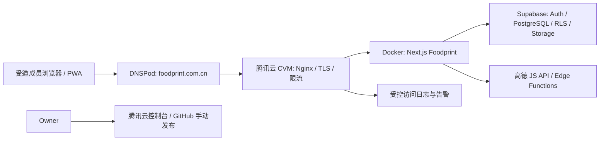

# 食迹 Foodprint｜V2 大陆域名与腾讯云迁移开发交接

> 状态：**待项目负责人批准后开发**
> 日期：2026-08-05
> 正式唯一入口：`https://foodprint.com.cn`
> 部署目标：腾讯云 CVM + Nginx + Docker Compose
> 关联规格：[V2 大陆部署与地图体验](./specs/2026-07-v2-mainland-maps-compliance.md)
> 架构决定：[V2 域名运行环境与数据平面边界](./decisions/2026-08-05-v2-domain-runtime-and-data-plane-boundary.md)

## 1. 本版本的决定与边界

V2 的首要目标是把 Foodprint 的 **Next.js 应用运行环境和正式访问入口** 从当前 Vercel 地址迁到腾讯云，并以 `foodprint.com.cn` 作为唯一正式域名。

Foodprint 的定位在本版本保持不变：这是一个由熟人邀请进入、以真实美食记录为主的小圈子产品，不是开放餐厅目录、公开内容流或陌生人社交网络。

### 1.1 V2-A：本次必须完成

- `https://foodprint.com.cn` 成为唯一正式入口；`www` 和旧 Vercel 地址只作重定向或回滚用途。
- Next.js、PWA、Server Actions、图片上传、健康检查和高德调用从腾讯云 CVM 提供服务。
- 腾讯云的 TLS、反向代理、访问边界、备份、监控和可回滚发布流程落地。
- 所有第三方回调/白名单改为新域名：Supabase Auth、Supabase Edge Functions、高德 JS Key、PWA 与应用 URL。
- 把“只在 UI 上显示邀请入口”升级为可验证的私域用户管理：不开放任意注册、不保留多人通用邀请链接、成员移除立即失去数据访问权。

### 1.2 V2-B：不自动混入本次切流的数据后端迁移

当前应用广泛使用 Supabase 的 PostgreSQL、Auth、Storage、RLS、RPC 和 Edge Functions。将网页部署到腾讯云，**不等于**数据库、认证和照片已经迁到腾讯云。

本次 V2-A 默认保留当前 Supabase 作为后端依赖，只迁移应用运行环境和正式域名；因此不在 DNS 切换时导出、重建或搬运真实用户数据。若项目负责人决定把数据平面也迁入腾讯云，应另立 V2-B 技术决策，选择“自建 Supabase”或“重写到腾讯云数据库/COS/自有认证”。这是一项独立的高风险工作，不能与域名切流合并执行。

### 1.3 明确不做

- 不新增公开注册、公开内容页、公开分享链接、成员搜索、关注、评论、点赞、热榜或推荐算法。
- 不新增手机号、身份证、人脸或其他新的身份信息采集。
- 不购买或依赖 CDN、负载均衡、WAF、腾讯云数据库、对象存储或日志服务作为 V2-A 的上线前提；如后续需要，可单独评估。
- 不在本次迁移中改变地点生命周期、推荐逻辑、RLS 的小组数据边界或现有地图免费版约束。
- 动态地图体验不阻塞域名迁移；只在 V2-A 稳定期结束后，再按独立小任务实施。

## 2. 当前事实与目标架构

当前代码已经具备 Docker standalone 输出、`/api/health`、Supabase SSR、受控高德 Edge Function 和邀请/Owner/Admin/Member 模型。这些能力可直接迁入腾讯云；但当前生产发布仍以 Vercel 为终点，且页面层的邀请注册不能阻止外部人直接调用 Supabase Auth 的公开注册接口。



### 2.1 域名与运行环境的唯一事实来源

| 场景 | 值 | 规则 |
| --- | --- | --- |
| 正式入口 | `https://foodprint.com.cn` | 唯一可被用户分享和用于认证回调的地址 |
| `www` | `https://www.foodprint.com.cn` | 308 跳转到正式入口，不承载独立会话 |
| 旧 Vercel 地址 | 旧 `*.vercel.app` 地址 | 在稳定期保留部署以供回滚；非正式入口一律跳转正式域名 |
| 预发布 | `preprod.foodprint.com.cn`（如启用） | 仅用于负责人验收；Nginx 以 IP 白名单或 Basic Auth 限制，不能成为公开入口 |
| 本地 | `http://localhost:3000` | 仅本机开发；不得写入正式应用环境变量 |

`NEXT_PUBLIC_APP_URL` 在浏览器构建时会进入客户端 bundle；腾讯云生产镜像构建时必须已是 `https://foodprint.com.cn`。不要以“容器启动后再覆盖”来替换它。

## 3. V2 里程碑与完成条件

| 里程碑 | 交付物 | 通过条件 |
| --- | --- | --- |
| M0｜迁移冻结与盘点 | 配置台账、现网备份、回滚点 | 当前 Vercel 部署、Supabase schema、Edge Function 版本和域名配置均已记录；无未审查的生产 migration |
| M1｜代码与镜像基础 | 安全 Docker 产物、Nginx/Compose 模板、统一环境配置 | 同一提交可在本机和腾讯云构建，镜像中不含 `.env*`、Git 元数据或私有文档 |
| M2｜私域用户治理 | 命名邀请、注册拦截、角色与审计权限 migration | 外部直接注册失败；错误邮箱、过期邀请、重复邀请和已移除成员均不能获得小组数据 |
| M3｜腾讯云预发布 | CVM、Security Group、TLS、Nginx、监控、快照 | `preprod` 仅负责人可访问，HTTPS、健康检查、邮件回调、地图、上传均成功 |
| M4｜第三方配置切换 | Supabase/Auth/Storage/Edge Function/高德白名单更新 | 新域名通过完整登录、邀请、搜索、图片和 PWA 验收；旧域名仍可回滚 |
| M5｜正式 DNS 切流 | DNS、镜像发布、回滚记录 | `foodprint.com.cn` 主路径稳定，错误率/资源指标正常，旧入口不再作为正式入口 |
| M6｜稳定期收口 | 7 天观察记录、恢复演练、文档更新 | 无 P0/P1 迁移问题；已验证应用回退、DNS 回退和成员权限回归 |

## 4. 编码工作包

### 4.1 运行配置与域名收束

新增一层明确的运行时配置，禁止页面、Server Action 和部署脚本自行拼接不同域名。

| 文件 | 改动 |
| --- | --- |
| `.env.example` | 增加脱敏的 `APP_CANONICAL_HOST`、`APP_TRUSTED_ORIGINS`、`DEPLOYMENT_VERSION` 样例；生产值只写入腾讯云受控环境文件和 GitHub Secrets |
| `src/lib/env.ts` | 校验正式环境必须为 HTTPS、无路径、无尾随 `/`；将可信 Origin 解析为精确集合，拒绝 `*` 和 Vercel Preview 通配符 |
| `src/lib/runtime/app-url.ts`（新增） | 提供 `getCanonicalAppUrl()`、`getAuthRedirectUrl(path)`、`isCanonicalHost(host)`；所有认证、邀请、重设密码链接改走该文件 |
| `src/app/(auth)/actions.ts`、`src/app/join/[token]/page.tsx`、`src/app/admin/actions.ts`、`src/app/admin/page.tsx` | 删除散落的 `process.env.NEXT_PUBLIC_APP_URL` 字符串处理，统一使用运行时配置 |
| `src/proxy.ts` | 非正式 Host（旧 Vercel、`www`）使用 308 跳转到正式入口；保留 `/api/health` 作为无认证的最小存活检查；不得按 Host 绕过认证 |
| `src/app/robots.ts`（新增）和根布局 Metadata | 添加 `noindex,nofollow` 与全站 `Disallow`；这不是访问控制，但避免私域内容被搜索引擎索引 |
| `next.config.ts` | 保留 `16mb` Server Action 上限；增加安全响应头配置。Server Action 默认同源校验足够时不额外放宽 `allowedOrigins`；若未来接入不同域名的反向代理，才以精确 Host 增加白名单，绝不使用通配符 |

安全响应头先在预发布以 Content-Security-Policy Report-Only 验证，再切换为强制模式。最低包含：`X-Content-Type-Options: nosniff`、`Referrer-Policy: strict-origin-when-cross-origin`、`X-Frame-Options: DENY`、`Permissions-Policy`（默认关闭不需要的相机、麦克风、定位），以及经实际地图/图片域名验证后的 CSP。

### 4.2 私域用户管理：必须从 UI 限制升级为后台限制

当前 `/join/[token]` 调用 `supabase.auth.signUp()`，而 Supabase 项目若允许公开注册，外部人仍可能直接调用 Auth API。V2 必须以以下原则重做邀请入口：

1. Supabase Auth 后台关闭 **Allow new users to sign up** 和匿名登录；保留受控的邮箱邀请流程。
2. Owner 在管理页填写受邀人的邮箱和显示名；不再生成可复制、可多次使用的通用邀请链接。
3. 服务器端先验证 Owner 身份和小组权限，再用 Service Role 发起受控邀请；Service Role 永不进入浏览器。
4. Foodprint 邀请记录绑定特定 `recipient_user_id`；认证后的 `accept_invitation` 必须验证 `auth.uid()` 与该受邀人匹配，且只允许一次成功加入。
5. 已有 Foodprint 账户由 Owner 按邮箱加入指定小组；新用户通过受控邮箱邀请完成密码设置后再加入。两条路径都不经过公开 `signUp`。
6. 现有多人通用邀请在切流前全部撤销或到期；历史记录保留，但不再能使用。

建议新增 migration（实际时间戳在编码时生成）：

```text
v2_private_invitation_enforcement.sql
  - invitations 增加 recipient_user_id、delivery_status、consumed_at
  - 旧 generic invitation 统一 revoked_at（不删除审计历史）
  - accept_invitation 校验受邀人、活跃小组、一次性使用和事务性 use_count
  - 新建 Owner-only 的 create_named_invitation / resend / revoke RPC
  - 取消普通 authenticated 直接创建通用 invitation 的执行权限

v2_audit_privacy_and_member_access.sql
  - 删除“所有小组成员可读 audit_logs”的策略
  - audit_logs 只允许 Owner 通过受控查询读取；普通成员只能看产品层的饭后聊内容
  - invitation 列表不再返回 token_ciphertext 或任何可复用 token
  - suspend / removed 状态在所有 RLS、Storage、RPC 中再次回归测试
```

若 Supabase Admin 邀请流程在预发布环境无法满足“新用户创建、邮件跳转、指定小组加入”的完整链路，则备用方案是使用 Supabase 的 **Before User Created Auth Hook** 校验受邀人专属邀请；两种方案只能选择一种并完整测试，不能只靠前端隐藏注册按钮。Supabase 官方支持关闭新用户注册和在用户创建前拒绝不符合策略的注册。([Supabase Auth 配置](https://supabase.com/docs/guides/auth/general-configuration), [Before User Created Hook](https://supabase.com/docs/guides/auth/auth-hooks/before-user-created-hook))

### 4.3 网络与应用安全

本版本不增加新的个人信息字段；网络安全工作只围绕已有邮箱、昵称、小组、餐饮记录和照片进行最小化保护。

- Nginx 仅对外暴露 80/443；Docker 端口使用 `127.0.0.1:3000:3000`，不得继续用 `0.0.0.0:3000:3000` 暴露 Next.js。
- Security Group 仅允许 80/443 公网入站；SSH 22 只允许负责人固定 IP 或受控运维入口；禁止数据库、Docker 和 Next.js 端口公网入站。
- Nginx 对登录、找回密码、邀请接受、上传和地图代理设置单独限速；所有错误页不泄露 Supabase、密钥、主机路径或堆栈。
- 自定义访问日志不记录 Cookie、Authorization、请求体、完整查询串或 Referer。`/join/<token>` 必须在 Nginx 日志中脱敏为 `/join/:token`，应用审计只写 invitation ID 或哈希，不写原始 token。
- 日志由受控运维账户读取，按轮转策略保留；小组成员不能从 Supabase API 读取运维审计日志。
- 图片 bucket 继续私有化；只保存 object key，读取仍使用短期签名 URL；不要把签名 URL 写入数据库、日志或页面缓存。
- 部署用户、Nginx、应用容器和备份目录使用最小权限。Docker 镜像以非 root 用户运行，生产环境文件权限为 `0600` 或更严格。

### 4.4 Docker、Nginx 与发布产物

本轮新增但不提交真实环境值的目录：

```text
deploy/
  compose.production.yml
  nginx/foodprint.conf
  systemd/foodprint-compose.service
  README.md
```

实现要求：

1. 新增 `.dockerignore`，至少排除 `.env*`（保留 `.env.example` 也不复制）、`.git`、`node_modules`、`.next`、`docs/private`、`docs/evidence`、测试输出和本地 Supabase 临时目录。当前 Dockerfile 的 `COPY . .` 没有 `.dockerignore`，这是 V2 前必须修复的密钥泄漏风险。
2. Dockerfile 使用非 root 用户运行；加入仅访问 `127.0.0.1:3000/api/health` 的健康检查；收到 `SIGTERM` 后允许 Next.js 完成在途请求再退出。
3. `compose.production.yml` 固定镜像标签为 Git commit SHA，不使用 `latest`；应用容器使用只读根文件系统（需要写入的临时目录显式挂载）；端口只绑定 loopback。
4. Nginx 负责 TLS、HTTP→HTTPS、`www`→正式域名跳转、Host 透传、`X-Forwarded-*`、请求体上限、限速、响应头和脱敏日志；不得缓存登录后 HTML、API、签名照片 URL 或 Server Action 响应。
5. 使用 `DEPLOYMENT_VERSION=$GITHUB_SHA` 构建镜像并写入 Next.js deployment ID，避免 PWA/浏览器持有旧 bundle 时出现 Server Action 版本错配。

Next.js 官方建议自建时用 Nginx 等反向代理保护 Node 进程；正式容器无需改为静态导出，因为本项目依赖 Server Actions、认证和 Route Handlers。([Next.js 自建指引](https://nextjs.org/docs/app/guides/self-hosting))

### 4.5 发布管道改造

当前 `release.yml` 的最后一步触发 Vercel Deploy Hook。V2 开发期间不要直接删除原流程；新增腾讯云发布 workflow，待预发布验证完成后再将它设为正式发布入口。

```text
PR → CI（应用检查 + 全量 migration 重放）
  → 项目负责人批准并合入 main
  → 手动 Release Tencent Cloud
      1. 再跑 npm run check
      2. 按既有受控流程应用向前兼容 Supabase migration / Edge Function
      3. 构建 foodprint:<git-sha> Docker 镜像
      4. 以受限 deploy 用户将镜像部署至 CVM
      5. 容器健康检查 + 预发布/正式域名 smoke test
      6. 记录镜像 SHA、时间、验收和回滚镜像
```

部署凭据只保存在 GitHub Actions Secrets 和腾讯云服务器受控账户中。代码库只保存变量名、模板和脱敏命令；禁止把 SSH 私钥、CVM IP、证书私钥、Service Role Key、数据库密码或 Docker registry token 写入文档和 Git。

## 5. 腾讯云控制台待办清单

### 5.1 切流前由项目负责人完成

| 项目 | 操作 | V2 是否必须 |
| --- | --- | --- |
| CVM | 确认 Linux、足够磁盘、固定公网 IP；建立非 root `deploy` 用户和 SSH Key 登录 | 必须 |
| Security Group | 只开放 80/443；22 仅负责人受控来源；关闭 3000、数据库和 Docker 端口公网访问 | 必须 |
| DNSPod | 建立 `preprod`（如使用）和正式 `@`/`www` 记录；切流前将 TTL 调低并记录旧记录 | 必须 |
| SSL 证书 | 为 `foodprint.com.cn` 与 `www.foodprint.com.cn` 申请/部署有效证书；先验证续期责任 | 必须 |
| 云监控 | 设置 CPU、内存、磁盘、带宽和实例不可达告警；告警通知给负责人 | 必须 |
| 云硬盘快照 | 每日快照、保留 7–30 天；在发布前额外做一个命名快照 | 必须 |
| 应用配置 | 在服务器创建 `/etc/foodprint/production.env`，权限 `0600`；填入真实 Supabase/高德/应用变量 | 必须 |
| CLS / COS | 小规模阶段可选。先用受控 Nginx 日志轮转和云硬盘快照；日志量、排障需求增加后再接 CLS，媒体后端迁移后再接 COS | 非阻塞 |
| CDN / CLB / WAF / 腾讯云数据库 | 不是当前私域小圈子的切流前提 | 不需要先购买 |

腾讯云云监控默认可用于 CVM 指标与告警配置；云硬盘支持定期快照，官方对核心业务建议每日快照并设置保留期。([CVM 监控与告警](https://cloud.tencent.com/document/product/213/5165), [定期快照](https://cloud.tencent.com/document/product/362/8191))

### 5.2 第三方控制台配置顺序

1. **Supabase Auth**：先将 Site URL 与 Redirect URLs 加入 `https://foodprint.com.cn`，保留旧 Vercel 地址直到稳定期结束；测试注册确认、登录和重设密码回跳。
2. **Supabase Edge Function Secrets**：`APP_ALLOWED_ORIGINS` 加入精确的 `https://foodprint.com.cn`，不加 `*.vercel.app`、`*` 或路径；函数重新发布后再验证地图。
3. **高德控制台**：JS API Key 域名白名单加入 `foodprint.com.cn` 与必要的 `www`；不修改 Web Service Key 的服务端秘密边界。
4. **腾讯云 SSL / Nginx**：确认域名证书、强制 HTTPS 和 canonical redirect 后，才进行正式 DNS 切换。
5. **DNSPod**：将 `foodprint.com.cn` 指向腾讯云 CVM；`www` 指向同一入口或 CNAME，再由 Nginx 统一跳转。

## 6. 切流、验证与回滚

### 6.1 切流前 24 小时

- M0–M4 的自动检查全部通过；预发布使用合成测试账户，不在生产用删除/隐藏操作试验。
- 记录当前 Vercel Deployment ID、当前 DNS 记录、当前 Supabase/Edge Function 版本、Docker 镜像 SHA 和最近可用云硬盘快照。
- 新域名已在腾讯云完成 HTTPS，且 Nginx 不暴露 3000 端口。
- 项目负责人使用 Owner 与普通 Member 各完成一次邀请、登录、地点搜索、记一顿、私有照片、下回吃、导出和退出小组测试。
- 验证旧 Vercel Host 会跳转正式域名；不要依赖浏览器 Cookie 跨域迁移，用户在新域名重新登录是预期且更安全的行为。

### 6.2 正式切流步骤

1. 冻结新的数据库结构变更与成员批量操作。
2. 手动触发经批准的腾讯云发布，将已验证镜像部署到 CVM。
3. 从外网访问 `https://foodprint.com.cn/api/health`，只确认 HTTP 200 和通用 `status: ok`，不得暴露后端详细状态。
4. 修改 DNS 记录到腾讯云；观察解析与证书链路。
5. 用 Owner、Member、未登录浏览器三种状态跑关键路径，并检查高德、图片签名 URL、Auth 回调和 PWA 安装。
6. 观察 30 分钟：HTTP 5xx、CPU、内存、磁盘、带宽、错误日志、异常登录/邀请请求。
7. 无异常后宣布切流完成，继续 7 天稳定期。

### 6.3 回滚原则

- 应用问题：部署上一枚已验证 Docker image SHA，数据库只用新的向前兼容 migration 修复，绝不 reset 真实数据库。
- 腾讯云不可用：DNS 恢复到已记录的旧 Vercel 入口；旧部署必须保持可运行至稳定期结束。
- 认证/地图配置问题：先收紧为旧的精确白名单或临时关闭受影响功能，不把 Origin 放宽为 `*`。
- 用户数据、照片、邀请或权限异常：停止相关写操作，保留最小证据，恢复最近备份并完成 RLS/Storage 复测；不直接在生产库执行无条件删除。

## 7. 验收清单

### 域名与运行

- [ ] `http://foodprint.com.cn` 308 到 HTTPS；`www` 308 到唯一正式域名。
- [ ] CVM 仅暴露 80/443；直接访问 `:3000`、数据库和 Docker API 均失败。
- [ ] `/api/health` 正常；错误响应不泄露栈、密钥、Supabase 项目地址或服务器路径。
- [ ] PWA 新域名可安装、更新、离线壳可用，且不缓存登录后页面/API/签名图片。
- [ ] 第三方回调、高德搜索、静态地图、图片上传和短期签名图片读取全部通过。

### 私域用户与数据

- [ ] 未登录用户不能看任何地点、成员、照片、饭后聊或导出数据。
- [ ] 直接调用 Supabase 新用户注册被拒绝；匿名登录关闭。
- [ ] 指定受邀人可完成加入；错误账户、过期/撤销邀请、重复接受和旧通用链接均被拒绝且不暴露原因细节。
- [ ] Owner/Admin/Member 三角色按批准的权限测试；被暂停或移除者刷新后无法再读取小组表、Storage 对象、RPC 和导出。
- [ ] 普通成员无法读取邀请 token、其他成员邮箱、运维审计日志或其他小组数据。
- [ ] 审计日志不含 Cookie、认证头、原始邀请 token、签名图片 URL 或完整查询串。

### 发布与恢复

- [ ] `npm run check`、`git diff --check`、新增 migration 的本地/CI 重放通过。
- [ ] 已记录本次 Docker image SHA、发布人、时间、配置变更、验收人和回滚 image SHA。
- [ ] CVM 快照策略和最近一次手动快照可见；已完成一次非生产恢复演练。
- [ ] 7 天稳定期后，旧 Vercel 入口不再作为正常入口，但保留脱敏发布记录与可恢复版本。

## 8. 开发顺序与提交拆分

为了避免域名、权限、部署和数据库迁移互相掩盖问题，按以下小提交推进：

1. `codex/v2-runtime-config`：统一 URL/Origin 配置、canonical redirect、robots 与配置测试。
2. `codex/v2-private-invites`：命名邀请、Auth 注册关闭、RLS/审计权限 migration、角色化测试。
3. `codex/v2-container-security`：`.dockerignore`、非 root Docker、健康检查、Compose/Nginx 模板与部署说明。
4. `codex/v2-tencent-release`：GitHub 手动发布 workflow、镜像版本、服务器部署与回滚脚本；不含真实凭据。
5. `codex/v2-cutover-validation`：预发布验收、第三方新域名配置、DNS 切流和稳定期发布记录。

每一项合入前都必须通过现有质量门槛；只有 M0–M4 通过、项目负责人明确批准后，才允许执行腾讯云控制台和 DNS 的实际改动。

## 9. V2-B 的后续入口

如果后续决定把 Supabase 数据平面也迁到腾讯云，必须新建 ADR 和独立 Spec，至少回答：数据库/认证/Storage 的目标形态、数据导出与校验、RLS/RPC 兼容性、照片对象迁移、密钥轮换、备份恢复、停机窗口、数据完整性比对和回滚。V2-A 稳定前不启动这项工作。
